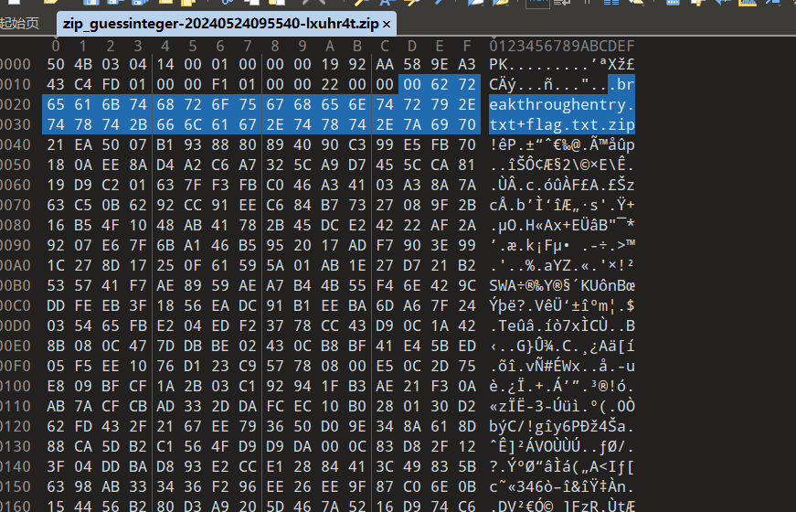
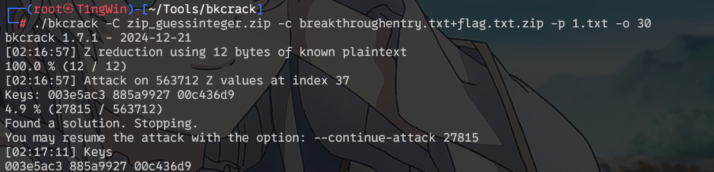
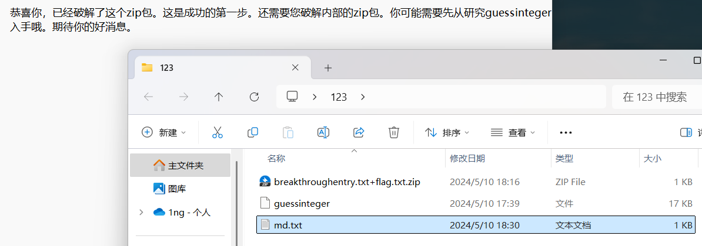
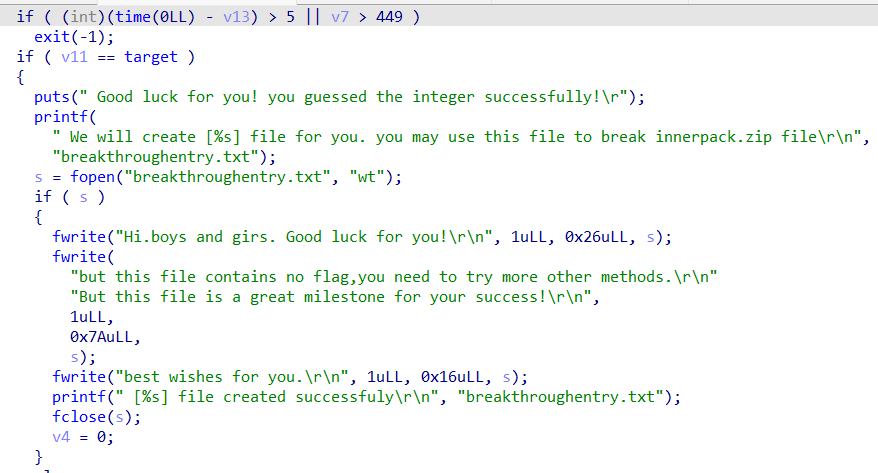
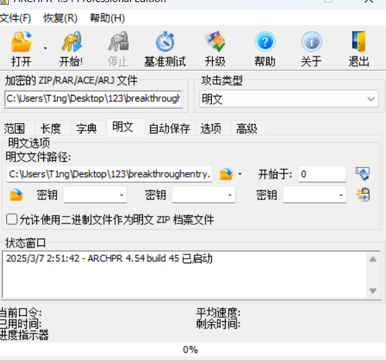
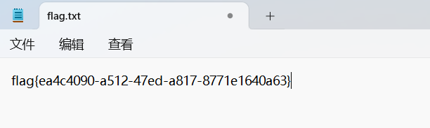

<!--more-->

<!-- Place resource files in the current article directory and reference them using relative paths, like this: ``. -->

```
ZIP包竟然加密了，快上我的暴力破解工具。难道我需要一个量子算力吗？能否使点巧力猜猜？
```

看到了`store`压缩方式，猜测需要明文攻击，而且压缩包名字较长大于12字符

```
echo -n 'breakthroughentry.txt' > 1.txt
```

bkcrack攻击部分明文，将明文`breakthroughentry.txt`写到1.txt中，偏移值为`30`，进行攻击





```
./bkcrack -C zip_guessinteger.zip -c breakthroughentry.txt+flag.txt.zip -p 1.txt -o 30
```




拿到key创建相同内容的压缩包

```
./bkcrack -C zip_guessinteger.zip -k 003e5ac3 885a9927 00c436d9 -U 123.zip
```




让我们研究`guessinteger`文件，在linux下缺少动态链接库，使用IDA看一下




创建了一个名为 `breakthroughentry.txt` 的文件，并向其中写入一些鼓励性的消息。
直接拿出来，注意`/r/n`

```
Hi.boys and girs. good luck for you!
But this file contains no flag,you need to try more other methods.
but this file is a great milestone for your success!
Best wishes for you.

```

明文使用360压缩zip



拿到flag




