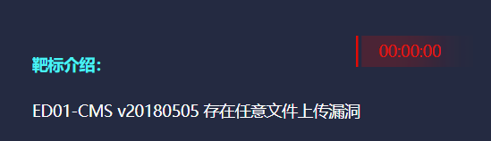
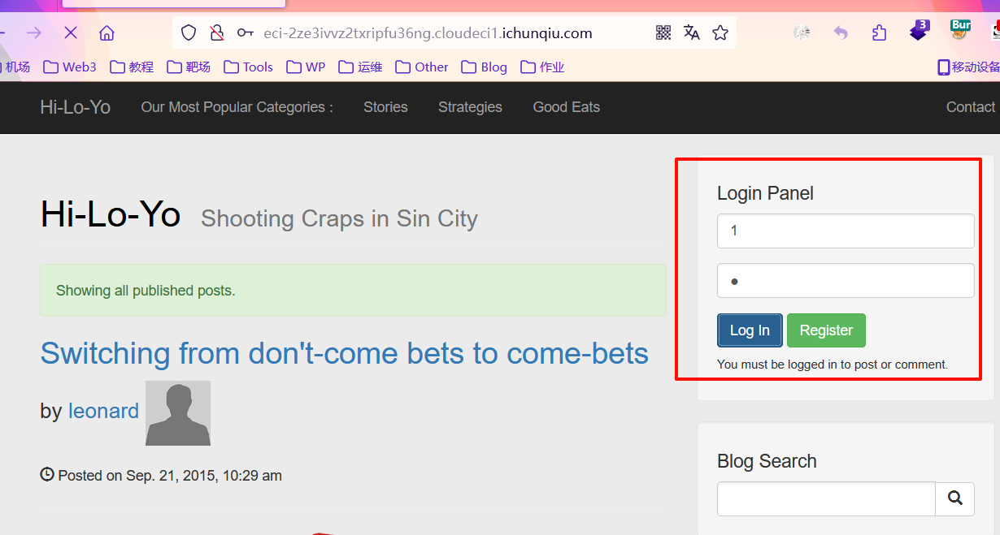
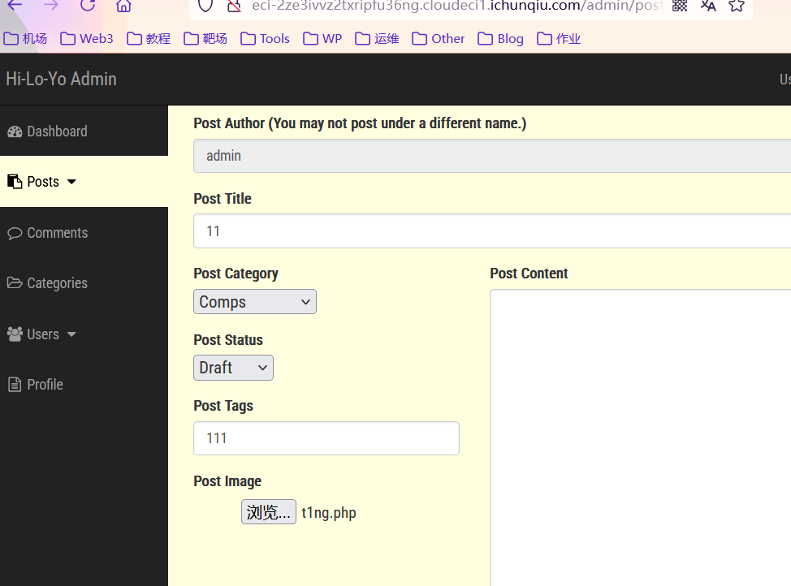
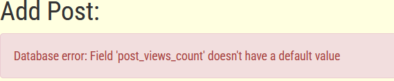
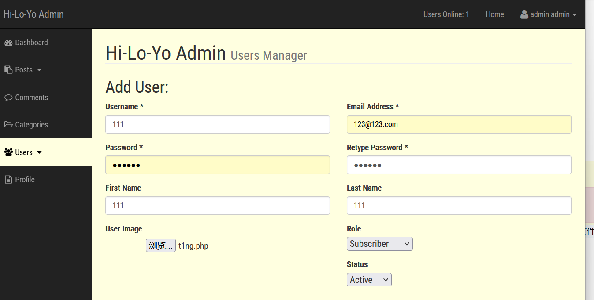
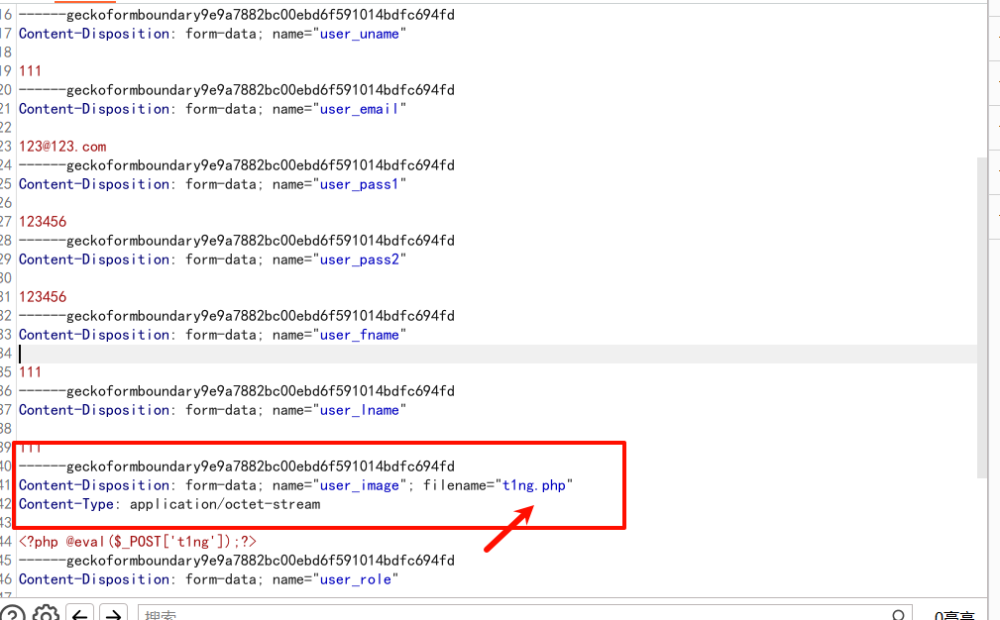
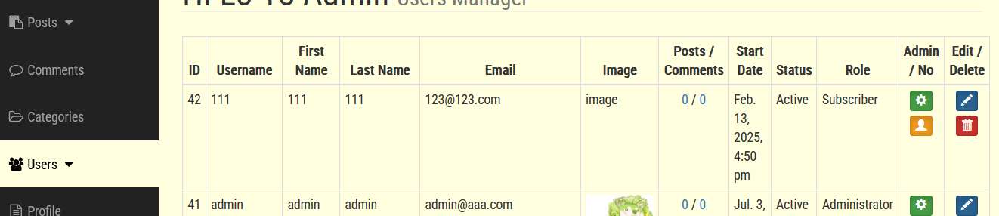
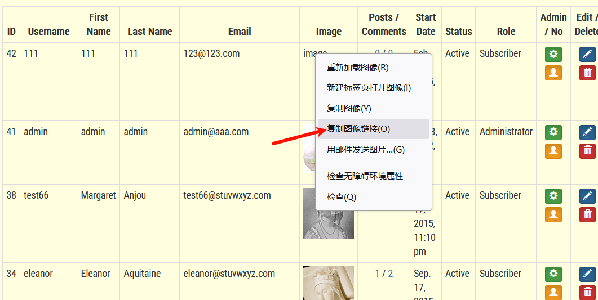
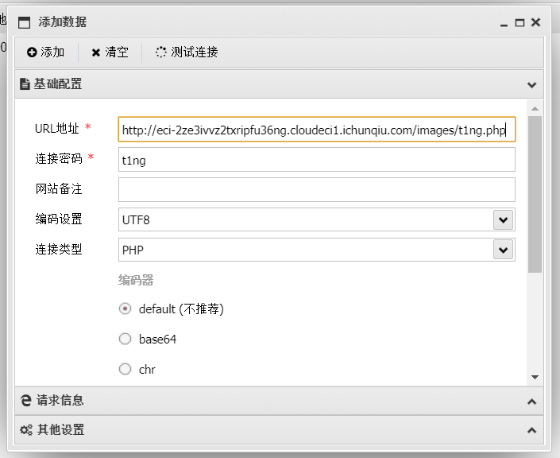
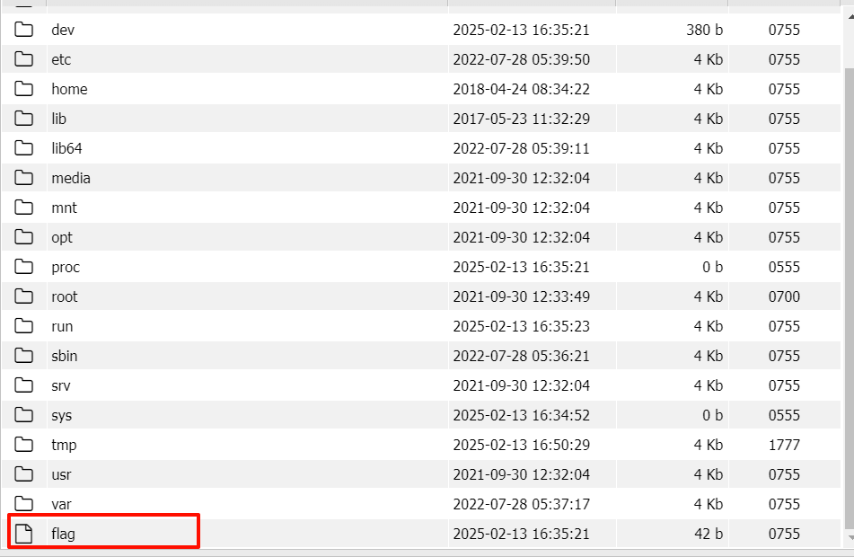

<!--more-->

<!-- Place resource files in the current article directory and reference them using relative paths, like this: ``. -->



未发现可用点，尝试弱口令爆破登录账户，发现账号密码为

```
账号：admin
密码：admin
```

发现文件上传页面

直接上传报错

不允许上传除了图片以外的文件，发现可能是权限问题，尝试在创建用户处上传文件。

上传php文件，抓包修改信息。

修改成jpg后缀上传，成功上传


用蚁剑连接，连接成功

发现flag

