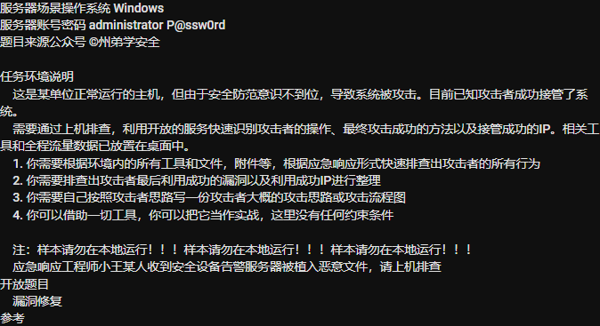
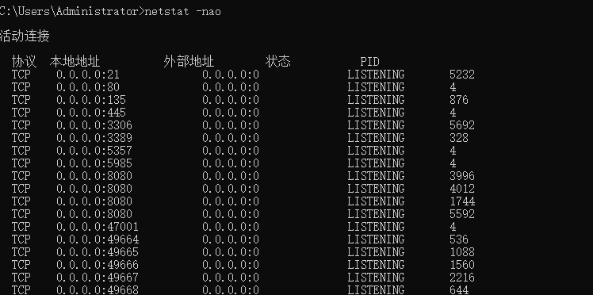
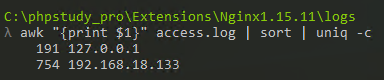
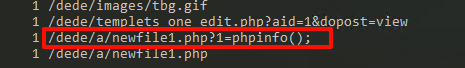
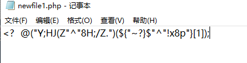
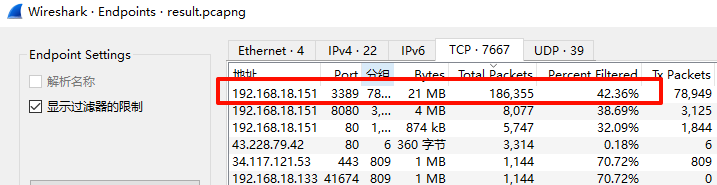
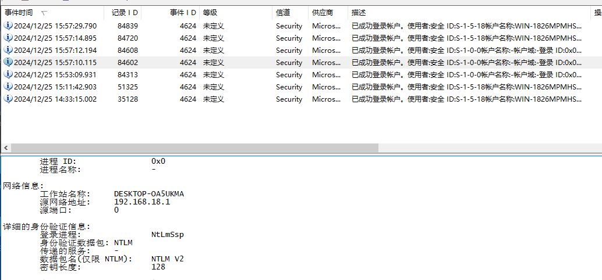

<!--more-->

<!-- Place resource files in the current article directory and reference them using relative paths, like this: ``. -->


远程连接一下桌面，看一下题目要求

```
请找出攻击者攻击成功的端口，如多个端口，则从小到大{x,x,x,}进行提交     
请找出攻击者上传的恶意文件名		
请找出攻击者最终攻击成功的端口	
请找出攻击者最终攻击成功端口的IP	
请找出攻击者最后接管服务器的IP	
```

先检查一下本地开启了什么服务

``` Shell
netstat -nao
```


目前看不出来哪个端口是攻击成功的端口，再去看看日志吧
小皮面板的php和Apache文件的日志没有东西，Nginx的日志文件，大多数是ip访问失败，统计一下。

```
awk "{print $1}" access.log | sort | uniq -c
```


发现除了127.0.0.1就是`192.168.18.133`，可以确定攻击者的ip是这个，再去看一下日志中执行的命令

```
awk "{print $7}" access.log | uniq -c
```


发现尝试访问phpinfo，由此可以推断，恶意文件的命名时`newfile1.php`
在`C:\phpstudy_pro\WWW\dedecms\a`找到了这个文件，查看一下

确信是一句话木马，恶意文件是`newfile1.php`

打开流量包文件，过滤`ip.dst == 192.168.18.133`，过滤出攻击机，统计攻击端点，

发现最后攻击的端口

打开桌面的`FullEventLogView`发现有许多与攻击机同段的ip，猜测为托管的服务器ip

最后得到的端口为21，3389，8080


 1 请找出攻击者攻击成功的端口，如多个端口，则从小到大{x,x,x,}
flag{21,3389,8080}

  2 请找出攻击者上传的恶意文件名
flag{newfile1.php}

  3 请找出攻击者最终攻击成功的端口
flag{3389}

  4 请找出攻击者最终攻击成功端口的IP
flag{192.168.18.133}

   5 请找出攻击者最后接管服务器的IP
flag{192.168.18.1}
