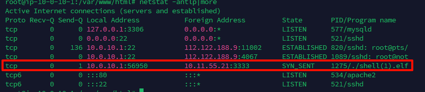

<!--more-->

<!-- Place resource files in the current article directory and reference them using relative paths, like this: ``. -->

```
账号：root 密码：linuxruqin
ssh root@IP
1.web目录存在木马，请找到木马的密码提交
2.服务器疑似存在不死马，请找到不死马的密码提交
3.不死马是通过哪个文件生成的，请提交文件名
4.黑客留下了木马文件，请找出黑客的服务器ip提交
5.黑客留下了木马文件，请找出黑客服务器开启的监端口提交
```

进入`/var/www/html`目录，列出文件

```
cd /var/www/html && ls -lah
```


看到`1.php`，直接读取查看

木马。密码为`1`
第一问：flag{1}

寻找不死马密码，`grep`和`find`分别对`.php`文件中的`eval`函数进行查找

```
find ./ -name "*.php" | xargs grep "eval"
```


发现存在在`shell.php`文件中，使用了md5进行加密，
[md5在线解密破解,md5解密加密](https://www.cmd5.com/default.aspx)

第二问：flag{hello}

判断生成不死马的文件，发现`index.php`文件有`$code`函数，生成不死马
第三问：flag{index.php}

找出木马ip，Linux下一般的木马后缀为`.elf`文件，在一开始的时候，该路径下有一个`shell(1).elf`文件，sftp传回本地，上传到微步云沙盒中分析

拿到ip
第四问：flag{10.11.55.21}

给与样本权限，然后打开另一个终端，

```
screen -S 1
1
chmod 777 'chmod(1).elf'
ctrl+a+d

netstat -antlp | more
```


恶意ip开启的端口为3333
第五问：flag{3333}
