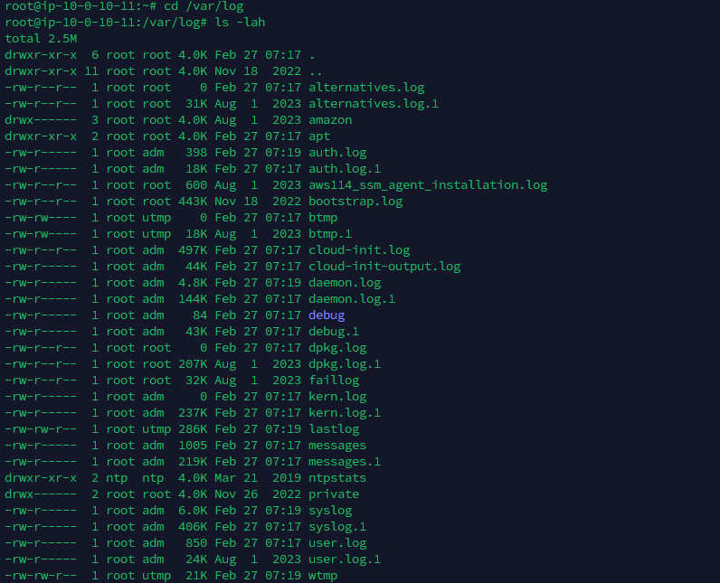
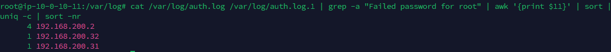
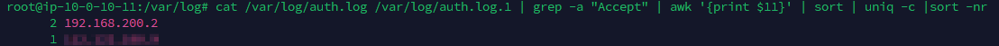
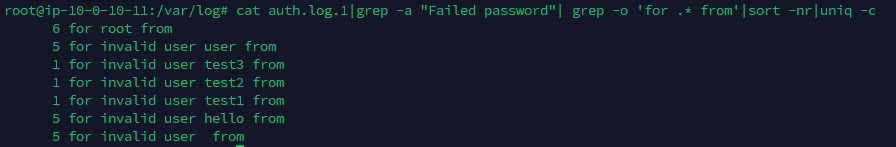
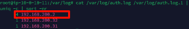
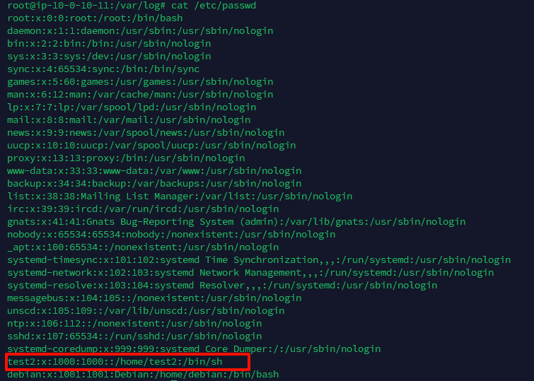

<!--more-->

<!-- Place resource files in the current article directory and reference them using relative paths, like this: ``. -->

```
1.有多少IP在爆破主机ssh的root帐号，如果有多个使用","分割
2.ssh爆破成功登陆的IP是多少，如果有多个使用","分割
3.爆破用户名字典是什么？如果有多个使用","分割
4.登陆成功的IP共爆破了多少次
5.黑客登陆主机后新建了一个后门用户，用户名是多少
```

首先了解一下Linux系统的日志文件存在位置及其所记录的内容

```
/var/log/syslog：记录系统的各种信息和错误。
/var/log/auth.log：记录身份验证相关的信息，如登录和认证失败。
/var/log/kern.log：记录内核生成的日志信息。
/var/log/dmesg：记录系统启动时内核产生的消息。
/var/log/boot.log：记录系统启动过程中的消息。
/var/log/messages：记录系统的广泛消息，包括启动和应用程序信息。
/var/log/secure：记录安全相关的消息。
/var/log/httpd/：记录Apache HTTP服务器的访问和错误日志（若安装了Apache）。
/var/log/nginx/：记录Nginx服务器的访问和错误日志（若安装了Nginx）。
```

首先目录切换到`/var/log`，列出所有的日志文件

```
cd /avr/log
ls -l
```




第一个任务：查找爆破SSH的IP，所以我们需要分析auth日志，判断爆破的账号为root，且多次失败，会出现`Failed password for root`

```
cat /var/log/auth.log /var/log/auth.log.1 | grep -a "Failed password for root" | awk '{print $11}' | sort | uniq -c | sort -nr
```

使用 `awk` 只提取日志中第 11 列的数据，通常这是尝试登录的源 IP 地址。
`sort`对提取出的ip进行排序。
`uniq -c`排序后的ip去重。
`sort -nr`从大到小排序（n按数字大小排序，r代表逆序）



1：flag{192.168.200.2,192.168.200.31,192.168.200.32}

第二个任务：查找爆破成功的ip。依旧是auth日志，只不过成功时会回显`Accept`

```
cat /var/log/auth.log /var/log/auth.log.1 | grep -a "Accept" | awk '{print $11}' | sort | uniq -c |sort -nr
```




下面是自己登陆的ip，
2：flag{192.168.200.2}

第三个任务：查找用户名字典
要求查找爆破时的用户名字典，也就是查找爆破过的用户名

```
cat auth.log.1|grep -a "Failed password"| grep -o 'for .* from'|sort -nr|uniq -c
```

`grep -o 'for .* from'`筛选包括`for ... from`的部分



3：flag{user,hello,root,test3,test2,test1}

第四个任务：查找爆破次数
也就是`192.168.200.2`被爆破了多少次，第一问时就得到了答案



4：flag{4}

第五个任务：查找后门用户。
可以查找/etc/passwd

```
cat /etc/passwd
```

找到不是系统命名的，且uid在`0~499`开外的



5：flag{test2}
