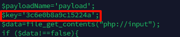

<!--more-->

<!-- Place resource files in the current article directory and reference them using relative paths, like this: ``. -->

```
靶机账号密码 root xjwebshell
1.黑客webshell里面的flag flag{xxxxx-xxxx-xxxx-xxxx-xxxx}
2.黑客使用的什么工具的shell github地址的md5 flag{md5}
3.黑客隐藏shell的完整路径的md5 flag{md5} 注 : /xxx/xxx/xxx/xxx/xxx.xxx
4.黑客免杀马完整路径 md5 flag{md5}
```

ssh连接，尝试手动查询
进入/var/www/html目录

```
cd /var/www/html
```

由于查询内容为webshell，所以文件后缀为.php，文件中应该会有eval()函数，构造命令

```
find ./ -name "*.php" | xargs grep "eval"
```

xargs命令通常与管道命令一起使用。例如，可以使用_find_命令查找文件，然后使用xargs将查找到的文件列表作为_rm_或其他命令的参数。

发现所给的三个文件中都符合要求，逐个排查

在gz.php中找到了第一问flag
1：flag{027ccd04-5065-48b6-a32d-77c704a5e26d}
还是这个文件，其中有一个key值

具体代表什么不清楚，尝试进行搜索

发现是哥斯拉，所以找到哥斯拉在github的地址（[BeichenDream/Godzilla: 哥斯拉](https://github.com/BeichenDream/Godzilla)）进行md5得到第二问结果

```
echo -n "https://github.com/BeichenDream/Godzilla" |md5sum |cut -d " " -f1
```

2：flag{39392de3218c333f794befef07ac9257}
接下来继续分析剩下的可疑文件，

发现在`ls`时，`.Mysqli.php`文件并没有显示，`ls -lah`命令显示出了隐藏文件。所以隐藏的Shell的路径为`/var/www/html/include/Db/.Mysqli.php`

```
echo -n "/var/www/html/include/Db/.Mysqli.php" |md5sum |cut -d " " -f1
```

3：flag{aebac0e58cd6c5fad1695ee4d1ac1919}

最后一个查找免杀码的完整路径。首先先了解一下PHP免杀一般的手段，字符串异或、base、rot13等。对base编码进行查找

```
find ./ -name "*.php" | xargs grep "base64"
```


根据路径，md5，拿到flag

```
echo -n "/var/www/html/wap/top.php" |md5sum |cut -d " " -f1
```

4：flag{eeff2eabfd9b7a6d26fc1a53d3f7d1de}
