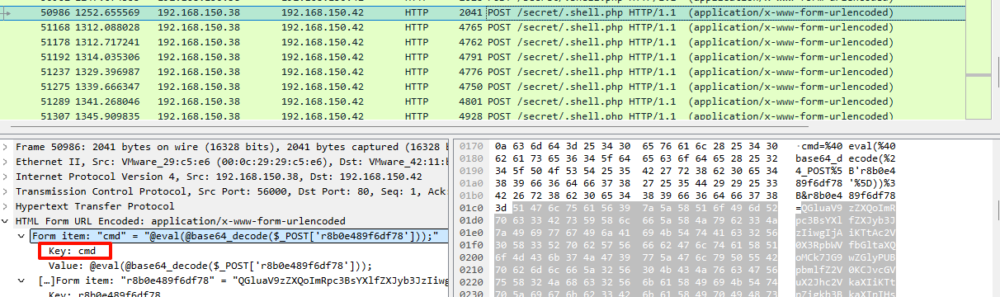

<!--more-->

<!-- Place resource files in the current article directory and reference them using relative paths, like this: ``. -->

```
账号:root 密码:root123 流量包在/result.pcap

1. 审计日志，攻击者下载恶意木马文件的 ip是多少 flag{ip}
2. 审计流量包，木马文件连接密码是什么? flag{xxx}
3. 审计流量包，攻击者反弹的IP和端口是什么? flag{ip:port}
4. 提交黑客上传恶意文件的 md5 md5sum xxx.so
5. 攻击者在服务器内权限维持请求外部地址和恶意文件的地址 flag{http://xxxxxxxxxx/xx.xxx}
```

ssh连接后，ftp把流量包下到本地进行分析


下载恶意木马，过滤器进行过滤，尝试是否使用curl下载

```
http contains "curl"
```


发现下载恶意木马文件的
1、flag{192.168.150.253}

根据第一问知道了木马文件的命名，过滤器直接过滤，而且利用POST传参

```
http contains "shell.php" && http.request.method == "POST"
```




2、flag{cmd}

第二问同样的过滤器，，依次查找执行的命令


3、flag{192.168.150.199:4444}

过滤tcp


找到了这个包，进行追踪


`redis`的主从复制上传了`modules.so`文件


4、flag{d41d8cd98f00b204e9800998ecf8427e}

看到这个就想到了计划任务，查看计划任务中是否有吧

```
cat /etc/crontab
```


5、flag{http://192.168.150.199:88/shell.php}


