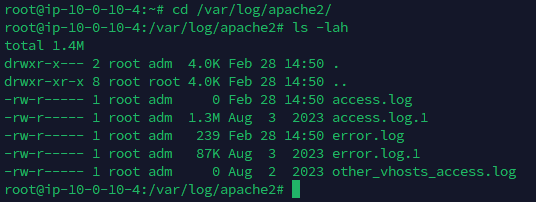
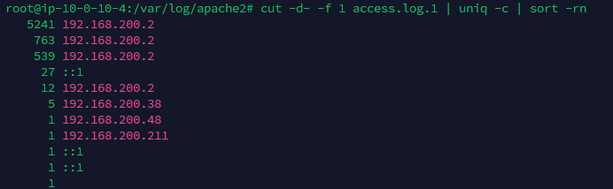
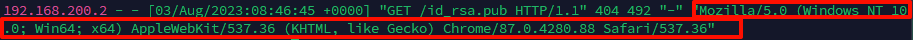
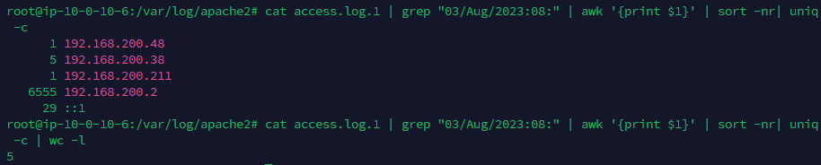

<!--more-->

<!-- Place resource files in the current article directory and reference them using relative paths, like this: ``. -->

```
账号密码 root apacherizhi
ssh root@IP
1、提交当天访问次数最多的IP，即黑客IP：
2、黑客使用的浏览器指纹是什么，提交指纹的md5：
3、查看包含index.php页面被访问的次数，提交次数：
4、查看黑客IP访问了多少次，提交次数：
5、查看2023年8月03日8时这一个小时内有多少IP访问，提交次数:
```

Apache分为两种类型：

    1. access log（访问日志）：客户端IP地址、请求时间、请求方式、请求资源、响应状态码、数据传输量等
    2. error log（错误日志）：运行过程中遇到的错误和警告信息，包括启动和停止时的信息。
       位置：
       access.log：/var/log/apache2/access_log.1
       error.log：/var/log/apache2/error.log.1
       
       这时候一般需要`cut`命令可以提取特定的数据，`-d-`指定字段的分隔符为`-`，`-f 1`提取第一个字段

```
cut -d- -f 1 access.log.1 | uniq -c | sort -rn
```




第一问：flag{192.168.200.2}

```
浏览器指纹（Browser Fingerprinting）是指通过收集和分析浏览器和设备的特征信息，创建一个唯一的标识符，从而识别或跟踪用户。这种技术不仅仅依赖于常规的Cookie，还利用浏览器和设备的多种属性来进行识别。
```

直接筛选一下第一问的ip地址

```
cat access.log.1 | grep 192.168.200.2
```




md5加密一下

```
echo -n "Mozilla/5.0 (Windows NT 10.0; Win64; x64) AppleWebKit/537.36 (KHTML, like Gecko) Chrome/87.0.4280.88 Safari/537.36" | md5sum
```


第二问：flag{2d6330f380f44ac20f3a02eed0958f66}

`grep`筛选特定字符串，`wc -l`统计

```
cat access.log.1 | grep "index.php" | wc -l
```

第三问：flag{27}

查看访问次数，同上

```
cat access.log.1 | grep "192.168.200.2" | wc -l
```

第四问：flag{6555}

查看2023年8月03日8时这一个小时内有多少IP访问
读取日志，筛选日志，提取ip排序，统计次数，计算数量

```
cat access.log.1 | grep "03/Aug/2023:08:" | awk '{print $1}' | sort -nr| uniq -c
cat access.log.1 | grep "03/Aug/2023:08:" | awk '{print $1}' | sort -nr| uniq -c | wc -l
```




第五问：flag{5}
