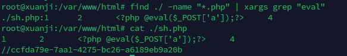
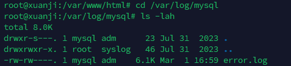
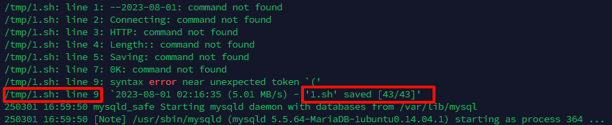
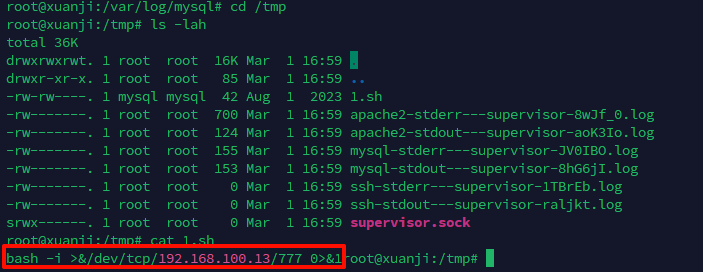
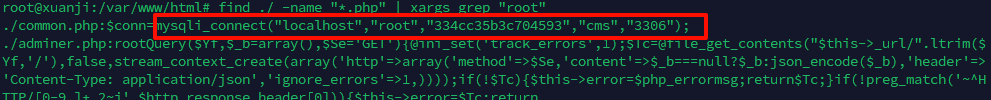
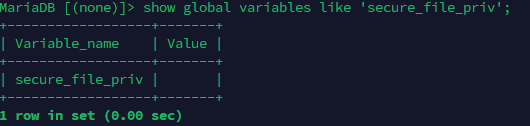
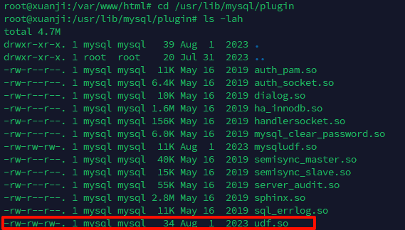
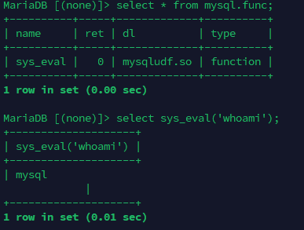

<!--more-->

<!-- Place resource files in the current article directory and reference them using relative paths, like this: ``. -->

```
mysql应急响应 ssh账号 root  密码 xjmysql
ssh env.xj.edisec.net  -p xxxxx
1.黑客第一次写入的shell flag{关键字符串} 
2.黑客反弹shell的ip flag{ip}
3.黑客提权文件的完整路径 md5 flag{md5} 注 /xxx/xxx/xxx/xxx/xxx.xx
4.黑客获取的权限 flag{whoami后的值}
```

首先了解一下mysql的日志位于`/var/log/mysql`下

写入的shell位置应该为于`/var/www/html`，shell的关键词应该为`eval`

```
find ./ -name "*.php" | xargs grep "eval"
```

发现sh.php文件，cat查看一下

第一问：flag{ccfda79e-7aa1-4275-bc26-a6189eb9a20b}

进入`/var/log/mysql`位置，

发现只有一个错误文件，查看一下

发现在`/tmp`目录下还有一个`1.sh`文件，切换到`/tmp`目录查看一下

找到了反弹shell的ip地址
第二问：flag{192.168.100.13}

既然用户已经进行了提权，首先考虑mysql的账号密码是否泄露，尝试在`/var/www/html`目录下找一下

```
find ./ -name "*.php" | xargs grep "root"
```

连接数据库

```
mysql -uroot -p334cc35b3c704593
```

首先检查一下是否是UDF提权，UDF提权的条件是`secure_file_priv`的值为空，检查一下环境变量

```
show global variables like 'secure_file_priv';
```

确认是UDF提权，UDF提权会在`/usr/lib/mysql/plugin`位置留下`def.so`文件，检查一下是否有

得到完整路径，计算一下md5

```
echo -n '/usr/lib/mysql/plugin/udf.so' | md5sum
```

第三问：flag{b1818bde4e310f3d23f1005185b973e7}

黑客进行了提权会写入自定义函数，再使用自定义函数进行命令执行，可知获得的权限
由上面的`error.log`日志可知，写入了`mysql.func`中


```
mysql -uroot -p334cc35b3c704593
select* from mysql.func;
select sys_eval('whoami');
```


第四问：flag{mysql}
