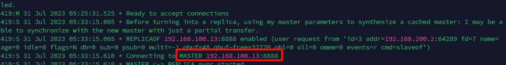
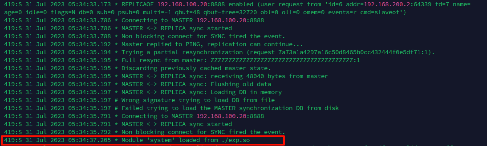
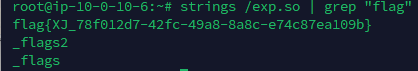
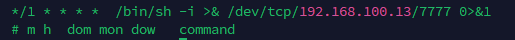
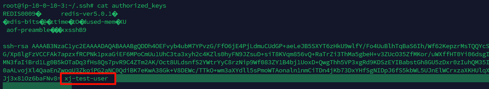
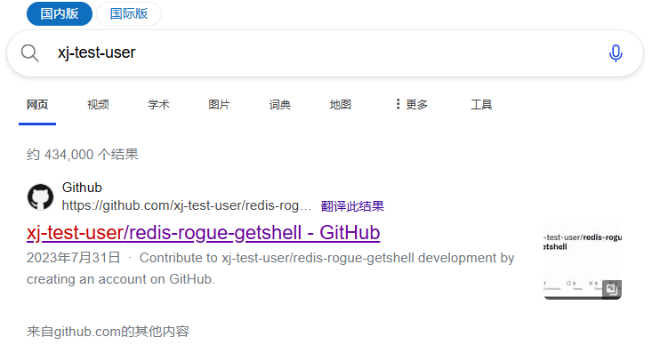
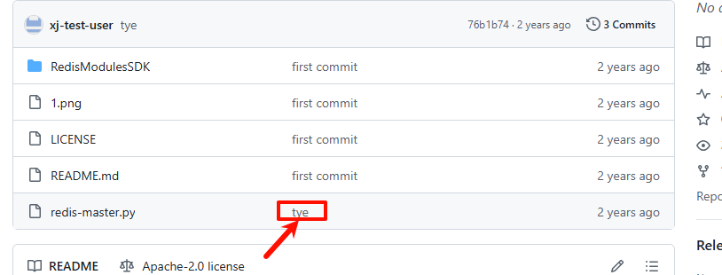
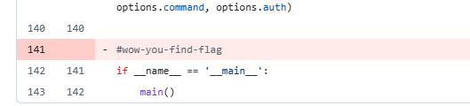
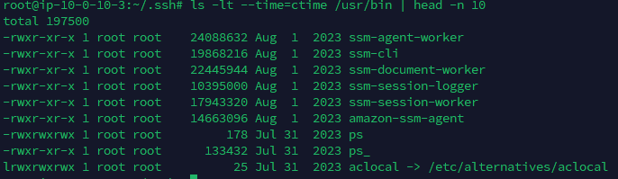
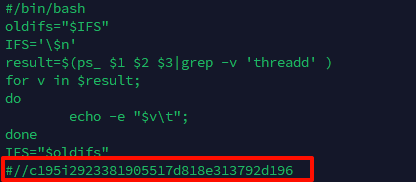

<!--more-->

<!-- Place resource files in the current article directory and reference them using relative paths, like this: ``. -->

```
通过本地 PC SSH到服务器并且分析黑客攻击成功的 IP 为多少,将黑客 IP 作为 FLAG 提交;
通过本地 PC SSH到服务器并且分析黑客第一次上传的恶意文件,将黑客上传的恶意文件里面的 FLAG 提交;
通过本地 PC SSH到服务器并且分析黑客反弹 shell 的IP 为多少,将反弹 shell 的IP 作为 FLAG 提交;
通过本地 PC SSH到服务器并且溯源分析黑客的用户名，并且找到黑客使用的工具里的关键字符串(flag{黑客的用户-关键字符串} 注关键字符串 xxx-xxx-xxx)。将用户名和关键字符串作为 FLAG提交
通过本地 PC SSH到服务器并且分析黑客篡改的命令,将黑客篡改的命令里面的关键字符串作为 FLAG 提交;
```

Redis攻击手法

```
未授权
远程代码执行
“公私钥认证”获得root
利用crontab反弹shell
拒绝服务
```

查看redis日志

```
cat /var/log/redis.log
```

发现总共就3个ip，`MASTER <-> REPLICA`发现进行了主从复制攻击，`192.168.100.13`进行攻击但是失败了，而`192.168.31.55`没有明显的恶意行为



所以，恶意ip判断为`192.168.100.20`
第一问：flag{192.168.100.20}

上传恶意文件，第一问查看了内容，可以直接去审一下日志



发现了上传的文件为`exp.so`，flag应该藏在文件里面，转字符串查找一下`flag`

```
strings /exp.so | grep "flag"
```




第二问： flag{XJ_78f012d7-42fc-49a8-8a8c-e74c87ea109b}

继续查看，发现那段特殊的日志

```
Jul 2023 05:33:50.693 # Error condition on socket for SYNC: Connection refused  
419:S 31 Jul 2023 05:33:51.694 * Connecting to MASTER 192.168.100.13:8888  
419:S 31 Jul 2023 05:33:51.694 * MASTER <-> REPLICA sync started  
419:S 31 Jul 2023 05:33:51.695 # Error condition on socket for SYNC: Connection refused  
419:S 31 Jul 2023 05:33:52.696 * Connecting to MASTER 192.168.100.13:8888  
419:S 31 Jul 2023 05:33:52.696 * MASTER <-> REPLICA sync started  
419:S 31 Jul 2023 05:33:52.697 # Error condition on socket for SYNC: Connection refused  
419:S 31 Jul 2023 05:33:53.698 * Connecting to MASTER 192.168.100.13:8888  
419:S 31 Jul 2023 05:33:53.698 * MASTER <-> REPLICA sync started  
419:S 31 Jul 2023 05:33:53.699 # Error condition on socket for SYNC: Connection refused  
419:S 31 Jul 2023 05:33:54.700 * Connecting to MASTER 192.168.100.13:8888  
419:S 31 Jul 2023 05:33:54.700 * MASTER <-> REPLICA sync started
```

接下来去查看计划任务

```
crontab -l
```

第一问我们知道`192.168.100.20`是黑客ip，推测为反弹shell的ip



第三问：flag{192.168.100.13}

通常SSH的验证分为密码验证和公钥验证
先查看一下`.ssh`里面都是有什么，



看到密钥文件有个奇怪的字符串`xj-test-user`，搜索一下






查看拿到后半段



第四问：flag{xj-test-user-wow-you-find-flag}

让我们查看篡改的命令，查找最新更改的几个文件

```
ls -lt --time=ctime /usr/bin | head -n 10
```




发现`ps`的权限为777，不正常，查看一下

```
cat /usr/bin/ps
```




第五问：flag{c195i2923381905517d818e313792d196}
