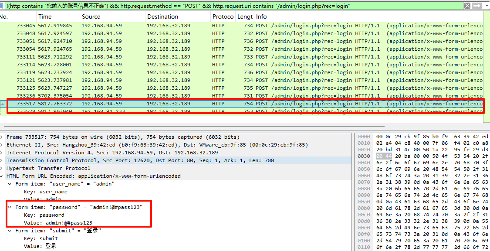
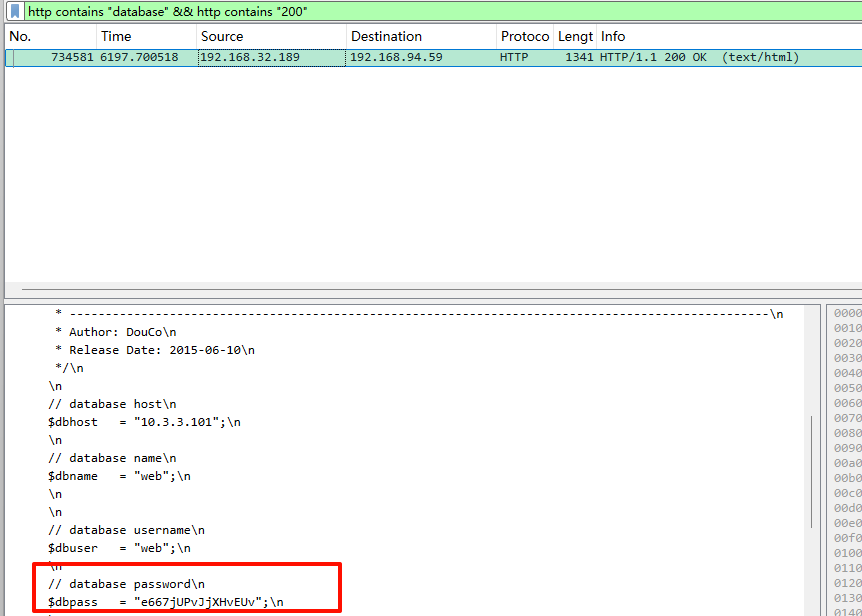

<!--more-->

<!-- Place resource files in the current article directory and reference them using relative paths, like this: ``. -->

```
1.黑客成功登录系统的密码 flag{xxxxxxxxxxxxxxx}
2.黑客发现的关键字符串 flag{xxxxxxxxxxxxxxxxxxxxxxxxxxxxxxxx}
3.黑客找到的数据库密码 flag{xxxxxxxxxxxxxxxx}
```

成功登录，通常会发送带有认证信息的http请求，用`POST`筛选一下，筛选掉账号信息不正确的，并按照登陆的url过滤

```
!(http contains "您输入的账号信息不正确") && http.request.method == "POST" && http.request.uri contains "/admin/login.php?rec=login"
```




第一问：flag{admin!@#pass123}

查找一下含有关键字`flag`的包。并且返回值为`200`

```
http contains "flag"
```

翻了一遍，还是按照时间排序，从大的开始找，192.168.94.59和192.168.32.189的请求报文和回显报文


第二问：flag{87b7cb79481f317bde90c116cf36084b}

顺着第二问，过滤http，在No.734555和No.734560有POST a.php，猜测应该是webshell，让我们查找数据库的密码，直接过滤包含`database`参数，而且访问返回值是成功的

```
http contains "database" && http contains "200"
```




第三问：flag{e667jUPvJjXHvEUv}
