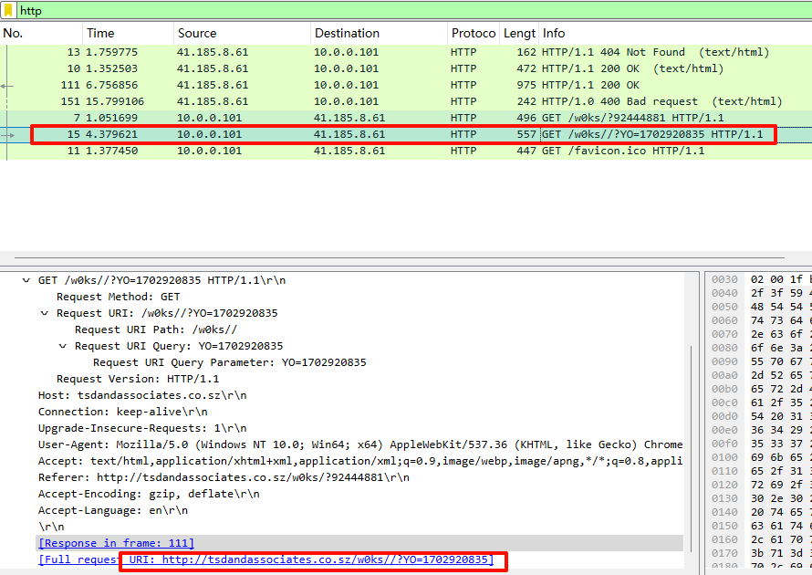

<!--more-->

<!-- Place resource files in the current article directory and reference them using relative paths, like this: ``. -->

```
服务器场景操作系统 None
服务器账号密码 None None
下载数据包文件 hacker1.pacapng，分析恶意程序访问了内嵌 URL 获取了 zip 压缩包，该 URL 是什么将该 URL作为 FLAG 提交 FLAG（形式：flag{xxxx.co.xxxx/w0ks//?YO=xxxxxxx}） (无需 http、https)；
下载数据包文件 hacker1.pacapng，分析获取到的 zip 压缩包的 MD5 是什么 作为 FLAG 提交 FLAG（形式：flag{md5}）；
下载数据包文件 hacker1.pacapng，分析 zip 压缩包通过加载其中的 javascript 文件到另一个域名下载后续恶意程序， 该域名是什么?提交答案:flag{域名}(无需 http、https)
```

打开文件过滤`http`

第一问：flag{tsdandassociates.co.sz/w0ks//?YO=1702920835}

还是追踪http，

典型的zip压缩包开头，导出


第二问 ：flag{F17DC5B1C30C512137E62993D1DF9B2F}

加载js文件

发现大量注释，发现`o457607380`参数后面的就是域名

查找拼接一下
第三问：flag{shakyastatuestrade.com}
