<!--more-->

<!-- Place resource files in the current article directory and reference them using relative paths, like this: ``. -->

```
1.木马的连接密码是多少
2.黑客执行的第一个命令是什么
3.黑客读取了哪个文件的内容，提交文件绝对路径
4.黑客上传了什么文件到服务器，提交文件名
5.黑客上传的文件内容是什么
6.黑客下载了哪个文件，提交文件绝对路径
```

第一问查找木马的连接密码，首先要先上传木马，或利用进行命令执行，所以上传以后或命令执行以后，`http`的返回值应该为`200`，过滤器筛选一下

```
http.response.code == 200
```

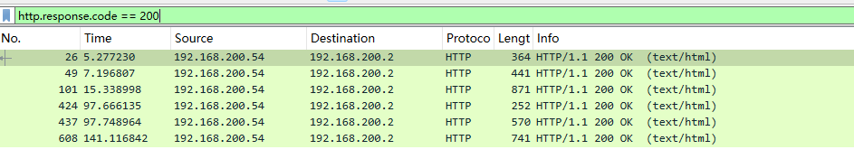
追踪一下`http流`，发现全是类似于
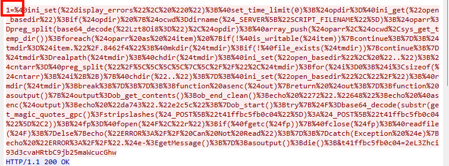
所以可以判断，木马的密码为`1`
第一问flag为：flag{1}

第二问让我们查找第一个执行的命令，实际上是寻找包含字符串“200”的HTTP数据包。

```
http contains "200"
```

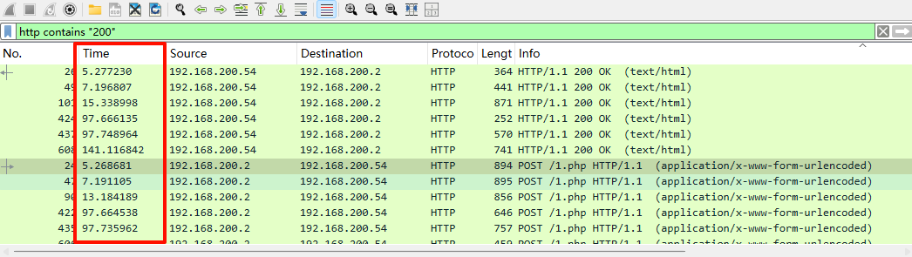
根据时间去查找第一个，点击查看详细，拉到最后发现，
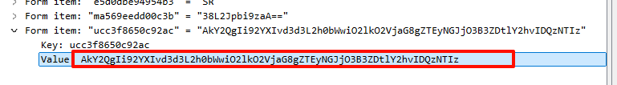
有一串base64，选中右键，显示分组字节，将开始值设置为`2`
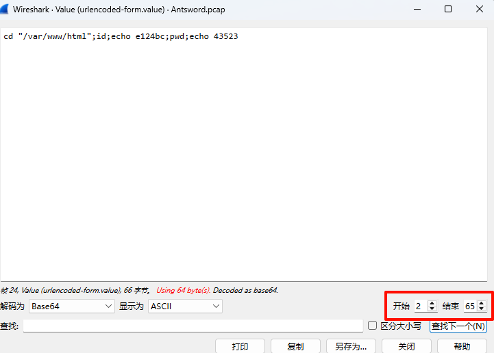
因为一般的会在编码前添加随机字符，导致不能正常解码。
尝试提交`cd`命令，发现并不对，考虑逻辑关系，拿到shell后，通常会先确认自己的权限，所以判断首先执行`id`
第二问flag{id}

第三问问我们读取了哪个文件的内容，提交文件绝对路径。文件读取通常使用特定的http方法，`GET`或者`POST`，可以通过`http.request.method == ""`
首先我们查看一下`POST`请求的http响应吧

```
http.request.method == "POST"
```

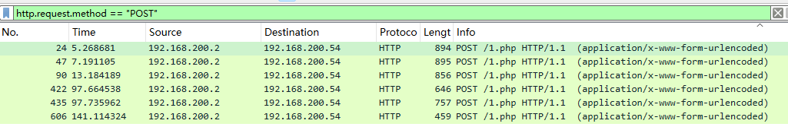
一个一个查看吧
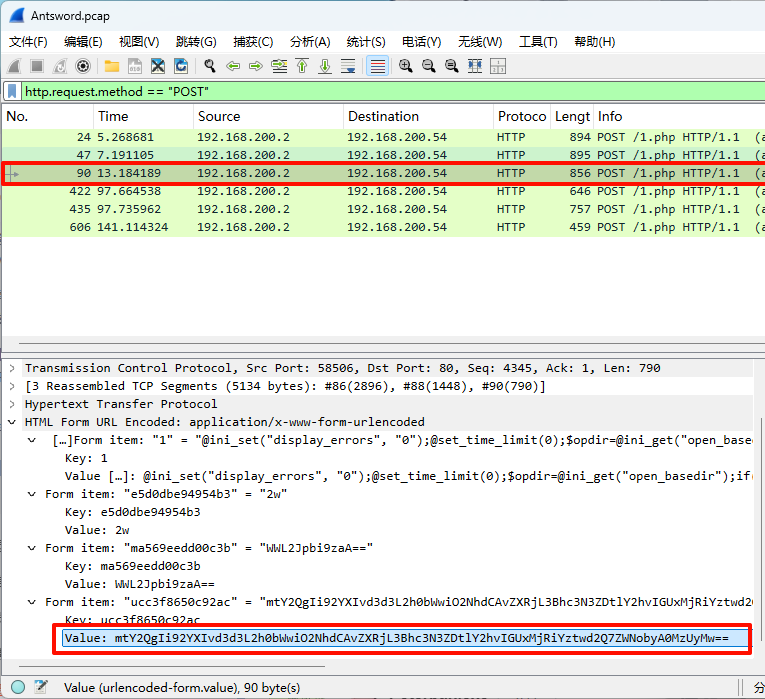
在第三个解码
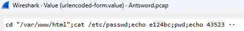
第三问：flag{/etc/passwd}

第四问让我们找到上传了什么文件到服务器，提交文件名
还是第三问的步骤，继续对这个页面进行查找
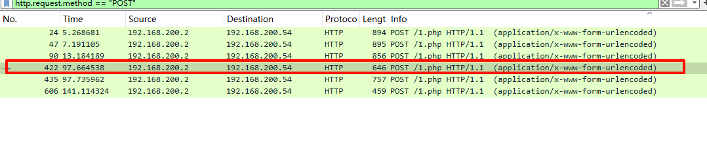
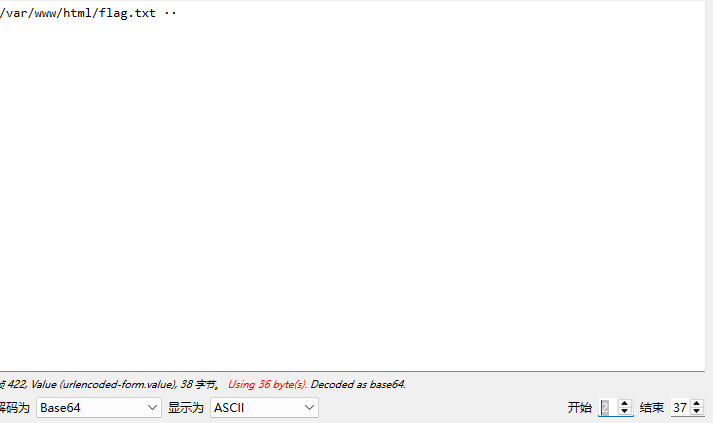
第四问：flag{flag.txt}

第五问上传的文件内容是什么。还是这个包，追踪`http流`
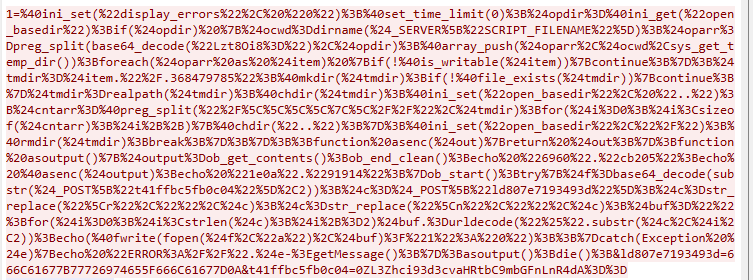
对这段内容尝试解码
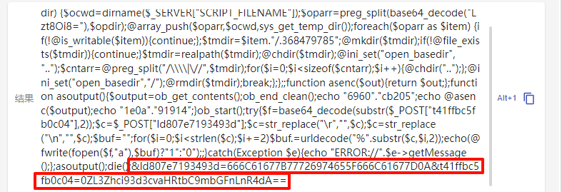上面的php代码，从post请求获得两个参数，第一个参数是写入文件的内容，第二个参数是传入到的路径。（注意传入路径需要去掉前两字符，消除混淆）
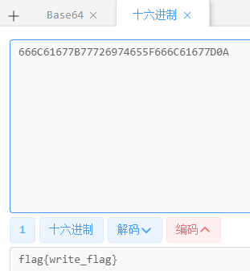
第五问：flag{write_flag}

第六问下载的文件，既然成功下载，那么响应包一定是`200`

```
http contains "200"
```

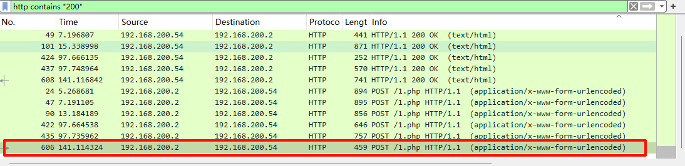
应该是最后执行的命令，所以筛选时间，
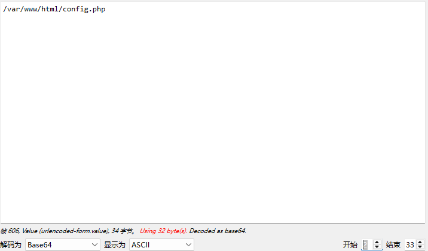
第六问：flag{/var/www/html/config.php}
