<!--more-->

<!-- Place resource files in the current article directory and reference them using relative paths, like this: ``. -->

```
通过本地 PC RDP到服务器并且找到黑客植入 shell,将黑客植入 shell 的密码 作为 FLAG 提交;
通过本地 PC RDP到服务器并且分析黑客攻击成功的 IP 为多少,将黑客 IP 作为 FLAG 提交;
通过本地 PC RDP到服务器并且分析黑客的隐藏账户名称,将黑客隐藏账户名称作为 FLAG 提交;
通过本地 PC RDP到服务器并且分析黑客的挖矿程序的矿池域名,将黑客挖矿程序的矿池域名称作为(仅域名)FLAG 提交;
```

远程连接，发现桌面有个`phpstudy`找到其中的`www`的目录。
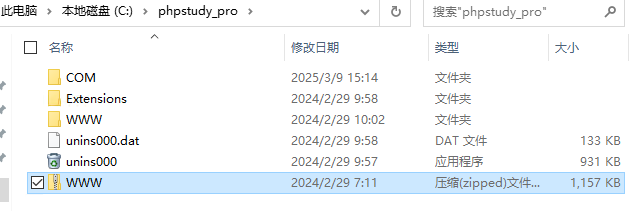
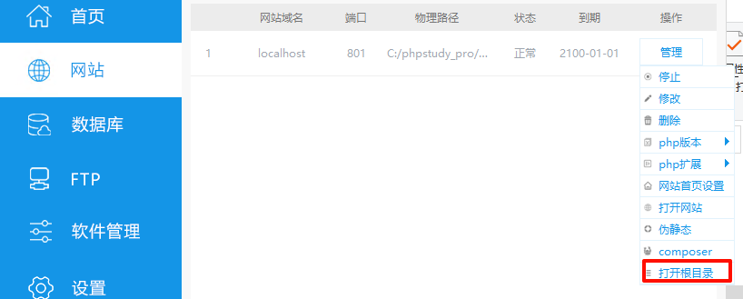
用D盾扫一下，查找到`shell.php`木马文件的位置
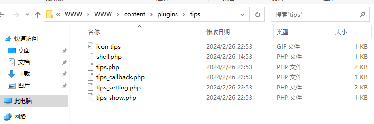
查看一下`shell.php`文件，默认密码`rebeyond`，
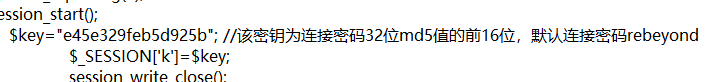
第一问：flag{rebeyond}

去查找日志文件，发现Nginx的目录的大小为0，所以存在在Apache日志文件，打开日志文件，ctrl+f查找一下`shell.php`
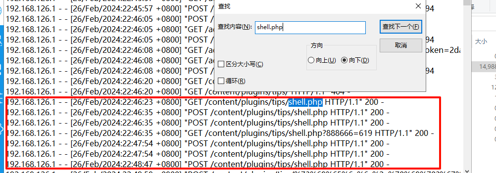
发现ip为`192.168.126.1`多次利用`shell.php`进行代码执行或文件操作。
第二问：flag{192.168.126.1}

找出黑客隐藏的用户名称，检查靶机的用户组即可
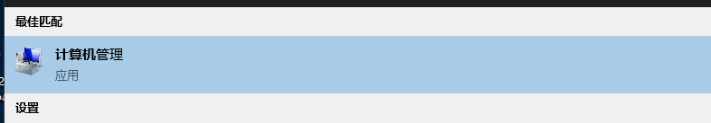
发现可疑用户
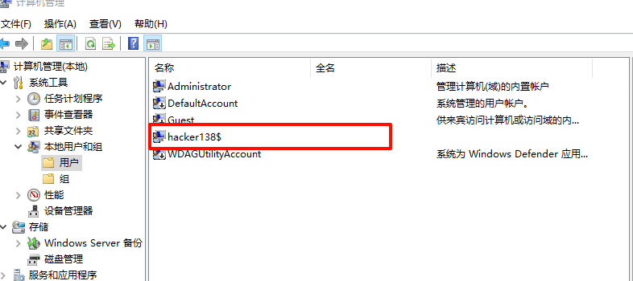
第三问：flag{hacker138}

查找一下hacker用户下的文件
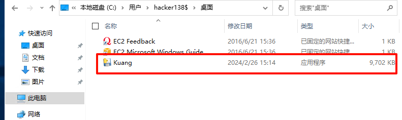
反编译一下
[pyinstxtractor/pyinstxtractor.py at master · extremecoders-re/pyinstxtractor](https://github.com/extremecoders-re/pyinstxtractor/blob/master/pyinstxtractor.py)
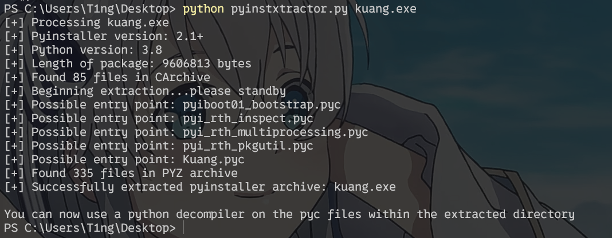
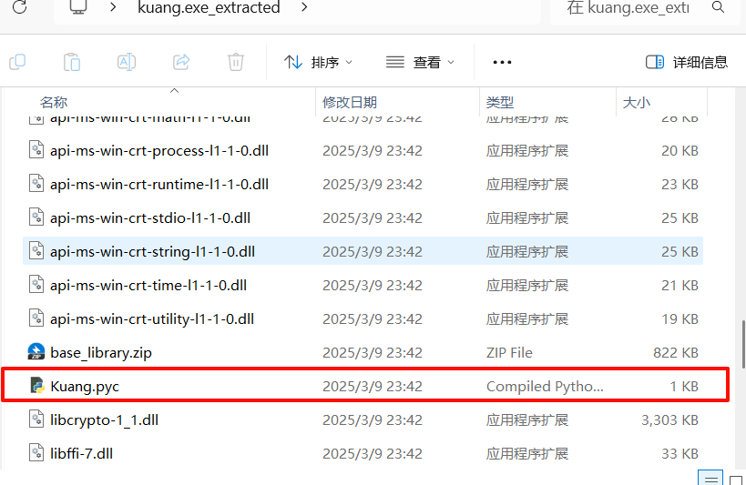
010查看一下文件，找到了域名
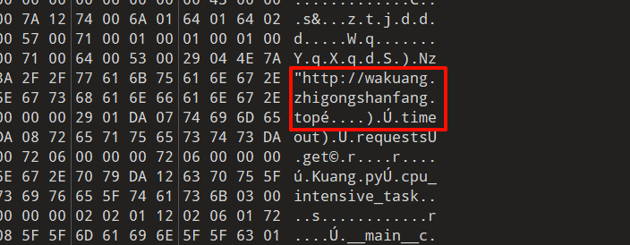
第四问：flag{wakuang.zhigongshanfang.top}
